# EGFR Expression in Penile Cancer
Last update: ``Thu Sep 25 11:23:47 2014``


```r
library(knitr)
opts_chunk$set(echo = FALSE, message = FALSE, warning = FALSE, results = "asis")
```


***

## Descriptive Analysis

### Clinical Features

#### Patient's age


|Statistics          |Values |
|:-------------------|:------|
|Mean                |65.8   |
|Standard Deviation  |12     |
|Median              |65     |
|Interquartile Range |18     |
|Mininum             |38     |
|Maximum             |93     |

*No. missing cases: 0*

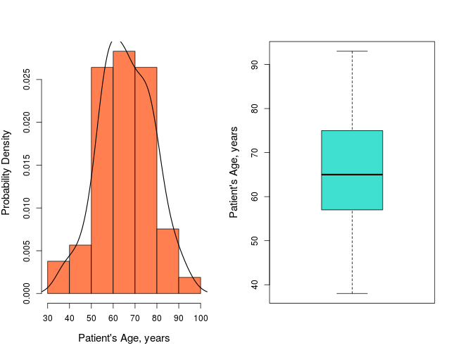 

***

#### Patient's race


|                 | No. Cases|    %|
|:----------------|---------:|----:|
|Caucasian        |      37.0| 69.8|
|African-American |      12.0| 22.6|
|Other            |       4.0|  7.5|

*No. missing cases: 0*

 

***

### Pathologic Features

#### Histologic subtype


|          | No. Cases|    %|
|:---------|---------:|----:|
|Basaloid  |       6.0| 11.3|
|Others    |       2.0|  3.8|
|Papillary |       2.0|  3.8|
|Usual     |      33.0| 62.3|
|Verrucous |       3.0|  5.7|
|Warty     |       5.0|  9.4|
|WB        |       2.0|  3.8|

*No. missing cases: 0*

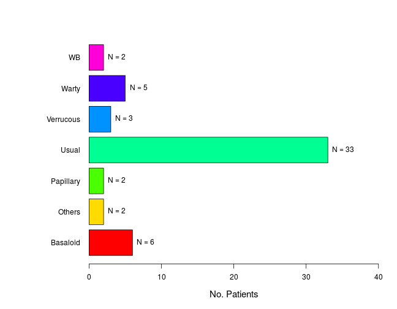 

***

#### Anatomical site


|               | No. Cases|    %|
|:--------------|---------:|----:|
|Glans          |      28.0| 52.8|
|Inner Foreskin |       1.0|  1.9|
|Shaft          |      16.0| 30.2|
|Urethra        |       8.0| 15.1|

*No. missing cases: 0*

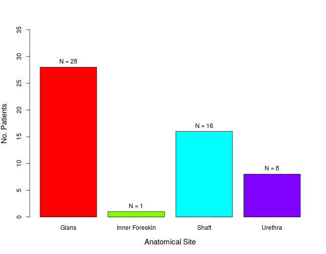 

***

#### Anatomical level


|               | No. Cases|    %|
|:--------------|---------:|----:|
|Lamina Propria |      20.0| 38.5|
|CS/Dartos      |      15.0| 28.8|
|CC/Skin        |      10.0| 19.2|
|Urethra        |       6.0| 11.5|
|Other          |       1.0|  1.9|

*No. missing cases: 1*

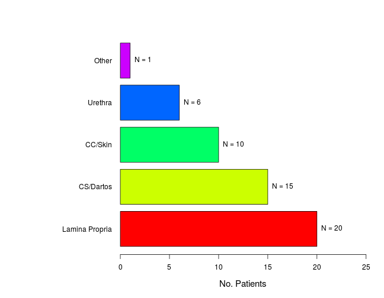 

***

#### Histologic grade


|        | No. Cases|    %|
|:-------|---------:|----:|
|Grade 1 |      11.0| 20.8|
|Grade 2 |      24.0| 45.3|
|Grade 3 |      18.0| 34.0|

*No. missing cases: 0*

 

***

#### Tumor thickness


|                | No. Cases|    %|
|:---------------|---------:|----:|
|Less than 5 mm  |      21.0| 39.6|
|5-10 mm         |      16.0| 30.2|
|More than 10 mm |      16.0| 30.2|

*No. missing cases: 0*

 

***

#### Tumor invasion of penile urethra


|    | No. Cases|    %|
|:---|---------:|----:|
|No  |      43.0| 81.1|
|Yes |      10.0| 18.9|

*No. missing cases: 0*

 

***

#### Lymphovascular invasion


|    | No. Cases|    %|
|:---|---------:|----:|
|No  |      36.0| 67.9|
|Yes |      17.0| 32.1|

*No. missing cases: 0*

 

***

#### Perineural invasion


|    | No. Cases|    %|
|:---|---------:|----:|
|No  |      36.0| 67.9|
|Yes |      17.0| 32.1|

*No. missing cases: 0*

 

***

#### HPV infection


|    | No. Cases|    %|
|:---|---------:|----:|
|No  |      45.0| 84.9|
|Yes |       8.0| 15.1|

*No. missing cases: 0*

 

***

#### Pathologic pT stage


|    | No. Cases|    %|
|:---|---------:|----:|
|Ta  |       1.0|  1.9|
|T1a |      19.0| 35.8|
|T1b |       1.0|  1.9|
|T2  |      22.0| 41.5|
|T3  |       9.0| 17.0|
|T4  |       1.0|  1.9|

*No. missing cases: 0*

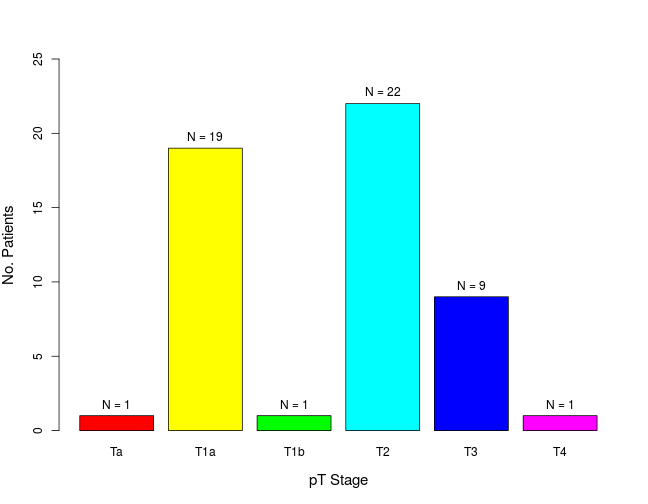 

***

#### Pathologic pN stage


|    | No. Cases|    %|
|:---|---------:|----:|
|pN0 |      13.0| 44.8|
|pN1 |       5.0| 17.2|
|pN2 |       4.0| 13.8|
|pN3 |       7.0| 24.1|

*No. missing cases: 24*

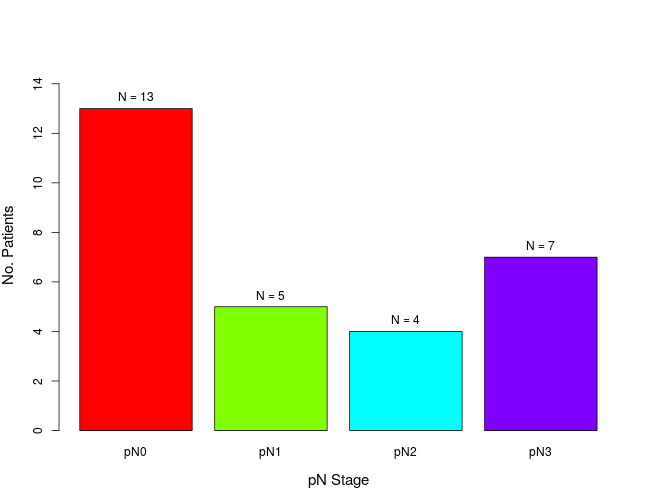 

***

#### Clinical stage


|           | No. Cases|    %|
|:----------|---------:|----:|
|Stage 0    |       1.0|  1.9|
|Stage I    |      18.0| 34.0|
|Stage II   |      18.0| 34.0|
|Stage IIIa |       5.0|  9.4|
|Stage IIIb |       2.0|  3.8|
|Stage IV   |       9.0| 17.0|

*No. missing cases: 0*

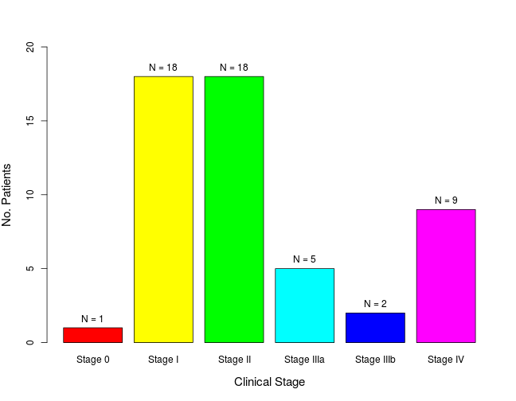 

***

#### Inguinal lymph node dissection


|              | No. Cases|    %|
|:-------------|---------:|----:|
|Prophylactic  |      10.0| 45.5|
|Post-Surgical |      12.0| 54.5|

*No. missing cases: 31*

 

***

#### Positive (metastatic) inguinal lymph nodes


|         | No. Cases|    %|
|:--------|---------:|----:|
|Negative |      13.0| 44.8|
|Positive |      16.0| 55.2|

*No. missing cases: 24*

 

***

#### Time from treatment to lymphadenectomy


|Statistics          |Values |
|:-------------------|:------|
|Mean                |2.2    |
|Standard Deviation  |3.8    |
|Median              |1      |
|Interquartile Range |1.7    |
|Mininum             |0      |
|Maximum             |14.5   |

*No. missing cases: 31*

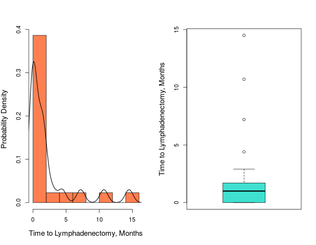 

***

### Treatment
#### Primary treatment


|                    | No. Cases|    %|
|:-------------------|---------:|----:|
|Partial Penectomy   |      48.0| 90.6|
|Pelvic Exenteration |       2.0|  3.8|
|Shave Biopsy        |       1.0|  1.9|
|Total Penectomy     |       2.0|  3.8|

*No. missing cases: 0*

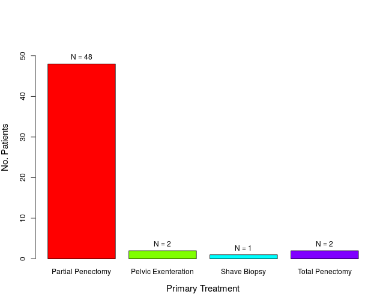 

***

#### Adjuvant chemotherapy


|    | No. Cases|  %|
|:---|---------:|--:|
|No  |        40| 87|
|Yes |         6| 13|

*No. missing cases: 7*

 

***

#### Adjuvant radiotherapy


|    | No. Cases|    %|
|:---|---------:|----:|
|No  |      43.0| 87.8|
|Yes |       6.0| 12.2|

*No. missing cases: 4*

 

***

### Outcome
#### Tumor recurrence


|    | No. Cases|    %|
|:---|---------:|----:|
|No  |      40.0| 90.9|
|Yes |       4.0|  9.1|

*No. missing cases: 9*

 

***

#### Time from primary treatment to tumor recurrence


|Statistics          |Values |
|:-------------------|:------|
|Mean                |20.5   |
|Standard Deviation  |23.7   |
|Median              |13.3   |
|Interquartile Range |20.8   |
|Mininum             |1      |
|Maximum             |54.4   |

*No. missing cases: 49*

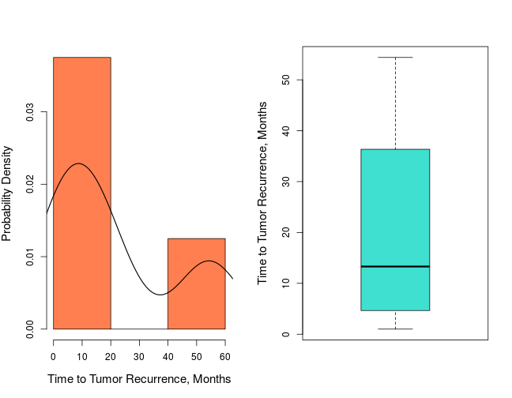 

***

#### Tumor progression


|    | No. Cases|    %|
|:---|---------:|----:|
|No  |      29.0| 61.7|
|Yes |      18.0| 38.3|

*No. missing cases: 6*

 

***

#### Time from primary treatment to tumor progression


|Statistics          |Values |
|:-------------------|:------|
|Mean                |9.8    |
|Standard Deviation  |9      |
|Median              |6      |
|Interquartile Range |13.3   |
|Mininum             |0.2    |
|Maximum             |31.4   |

*No. missing cases: 39*

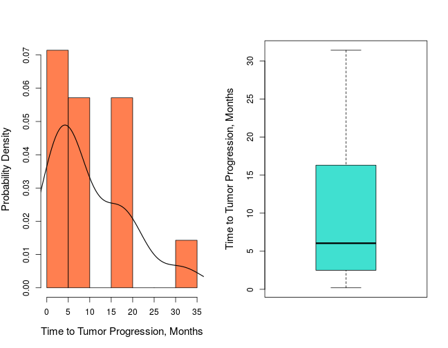 

***

#### Distant (visceral) metastasis


|    | No. Cases|    %|
|:---|---------:|----:|
|No  |      26.0| 57.8|
|Yes |      19.0| 42.2|

*No. missing cases: 8*

 

***

#### Time from primary treatment to distant metastasis


|Statistics          |Values |
|:-------------------|:------|
|Mean                |9.8    |
|Standard Deviation  |7      |
|Median              |10.7   |
|Interquartile Range |13.1   |
|Mininum             |1.3    |
|Maximum             |19.4   |

*No. missing cases: 44*

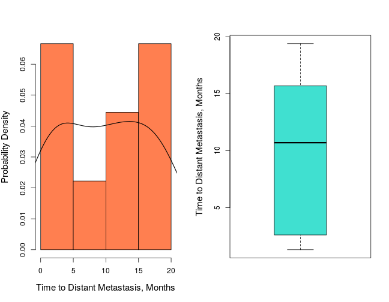 

***

#### Patient's outcome


|                      | No. Cases|    %|
|:---------------------|---------:|----:|
|Died of Disease       |      11.0| 20.8|
|Died of other Causes  |      15.0| 28.3|
|Alive with Disease    |      10.0| 18.9|
|Alive with No Disease |      16.0| 30.2|
|No Follow-Up          |       1.0|  1.9|

*No. missing cases: 0*

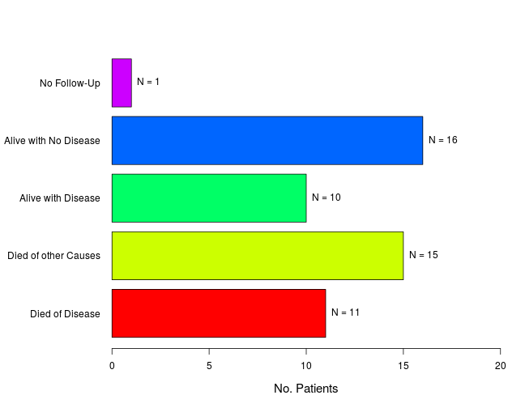 

***

#### Total follow-up time (months)


|Statistics          |Values |
|:-------------------|:------|
|Mean                |37.2   |
|Standard Deviation  |43.5   |
|Median              |17.9   |
|Interquartile Range |47.2   |
|Mininum             |0.1    |
|Maximum             |191.8  |

*No. missing cases: 2*

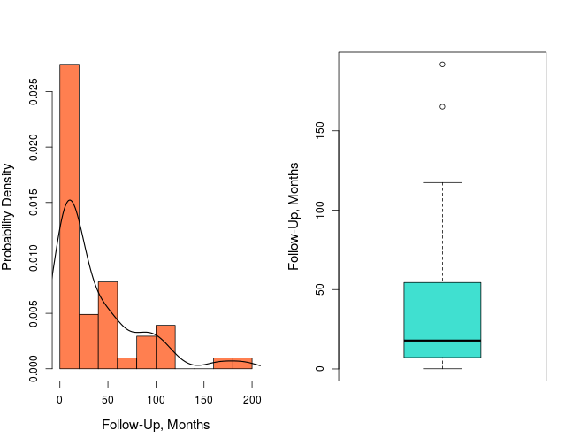 

***

### EGFR expression
#### EGFR median score


|Statistics          |Values |
|:-------------------|:------|
|Mean                |8.3    |
|Standard Deviation  |6      |
|Median              |8.1    |
|Interquartile Range |10.1   |
|Mininum             |0      |
|Maximum             |20     |

*No. missing cases: 1*

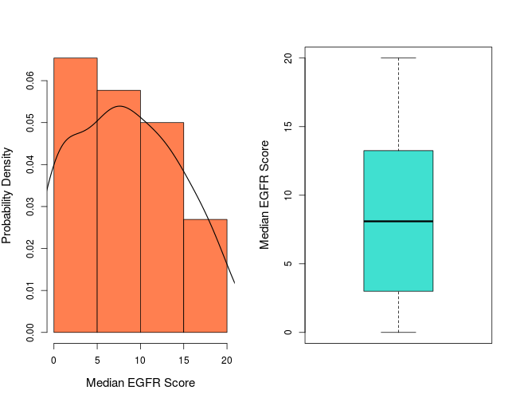 

***

#### EGFR categories


|              | No. Cases|    %|
|:-------------|---------:|----:|
|Negative EGFR |      16.0| 30.8|
|Low EGFR      |      10.0| 19.2|
|High EGFR     |      26.0| 50.0|

*No. missing cases: 1*

 

***

## Association Analysis


### Clinical features
#### Patient's age and EGFR


<table frame="hsides" rules="groups">
<thead>
<tr class="center">
  <th></th>
  <th>Negative EGFR</th>
  <th>Low EGFR</th>
  <th>High EGFR</th>
</tr>
</thead>
<tbody>
<tr class="center">
  <th class="left">Mean</th>
  <td>64.0</td>
  <td>67.8</td>
  <td>65.8</td>
</tr>
 <tr class="center">
  <th class="left">SD</th>
  <td>12.2</td>
  <td>11.9</td>
  <td>12.4</td>
</tr>
 <tr class="center">
  <th class="left">Median</th>
  <td>65.5</td>
  <td>65.0</td>
  <td>65.0</td>
</tr>
 <tr class="center">
  <th class="left">IQR</th>
  <td>18.0</td>
  <td>20.0</td>
  <td>17.5</td>
</tr>
 <tr class="center">
  <th class="left">Maximum</th>
  <td>80.0</td>
  <td>87.0</td>
  <td>93.0</td>
</tr>
 <tr class="center">
  <th class="left">Minimum</th>
  <td>38.0</td>
  <td>56.0</td>
  <td>39.0</td>
</tr>
</tbody>
</table>


*No. missing cases: 0*

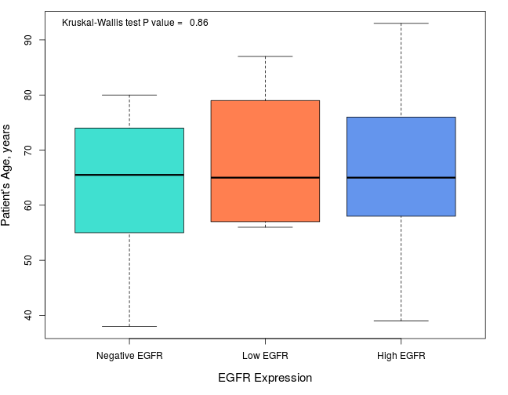 

***

#### Patient's race and EGFR


<table frame="hsides" rules="groups">
<thead>
<tr class="center">
  <th>&nbsp;</th>
  <th>&nbsp;</th>
  <th colspan="3">EGFR</th>
</tr>
 <tr class="center">
  <th>race</th>
  <th></th>
  <th>Negative EGFR</th>
  <th>Low EGFR</th>
  <th>High EGFR</th>
</tr>
</thead>
<tbody>
<tr class="center">
  <th class="left">Caucasian</th>
  <th class="left">Count</th>
  <td>12</td>
  <td> 8</td>
  <td>17</td>
</tr>
 <tr class="center">
  <th class="left">&nbsp;</th>
  <th class="left">Percent</th>
  <td>32.4</td>
  <td>21.6</td>
  <td>45.9</td>
</tr>
 <tr class="center">
  <th class="left">African-American</th>
  <th class="left">Count</th>
  <td> 3</td>
  <td> 1</td>
  <td> 7</td>
</tr>
 <tr class="center">
  <th class="left">&nbsp;</th>
  <th class="left">Percent</th>
  <td>25.0</td>
  <td> 8.3</td>
  <td>58.3</td>
</tr>
 <tr class="center">
  <th class="left">Other</th>
  <th class="left">Count</th>
  <td> 1</td>
  <td> 1</td>
  <td> 2</td>
</tr>
 <tr class="center">
  <th class="left">&nbsp;</th>
  <th class="left">Percent</th>
  <td>25.0</td>
  <td>25.0</td>
  <td>50.0</td>
</tr>
 <tr class="center">
  <th class="left">All</th>
  <th class="left">Count</th>
  <td>16</td>
  <td>10</td>
  <td>26</td>
</tr>
 <tr class="center">
  <th class="left">&nbsp;</th>
  <th class="left">Percent</th>
  <td>30.2</td>
  <td>18.9</td>
  <td>49.1</td>
</tr>
</tbody>
</table>

*No. missing cases: 0*

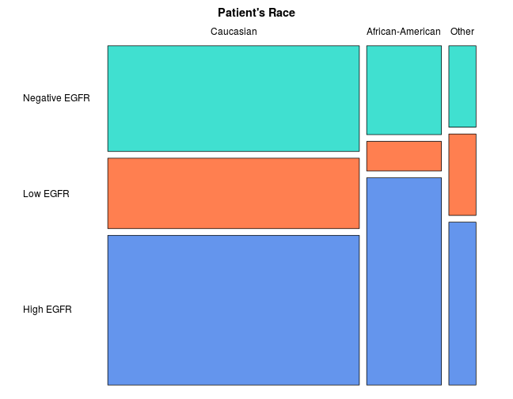  

***

### Pathologic features
#### Histologic subtype and EGFR


Categorical Level | Negative EGFR | Low EGFR | High EGFR
--- | :---: | :---: | :---:
Basaloid | 4 (66.7) | 1 (16.7) | 1 (16.7)
Others | 0 (0) | 1 (50) | 1 (50)
Papillary | 0 (0) | 0 (0) | 2 (100)
Usual | 8 (25) | 5 (15.6) | 19 (950)
Verrucous | 1 (33.3) | 1 (33.3) | 1 (33.3)
Warty | 3 (60) | 1 (20) | 1 (20)
WB | 0 (0) | 1 (50) | 1 (50)

*No. missing cases: 0*

 

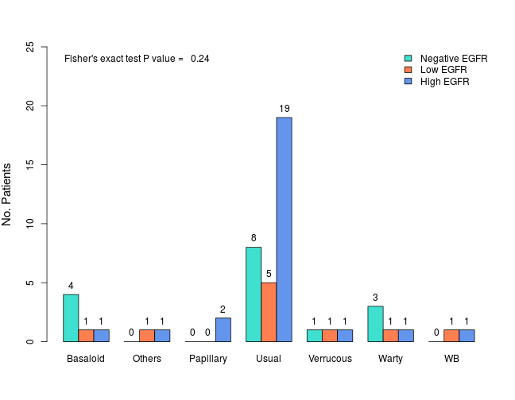 

***

#### Anatomical site and EGFR


Categorical Level | Negative EGFR | Low EGFR | High EGFR
--- | :---: | :---: | :---:
Glans | 7 (25.9) | 6 (22.2) | 14 (51.9)
Inner Foreskin | 0 (0) | 1 (100) | 0 (0)
Shaft | 5 (31.2) | 3 (18.8) | 8 (50)
Urethra | 4 (50) | 0 (0) | 4 (25)

*No. missing cases: 0*

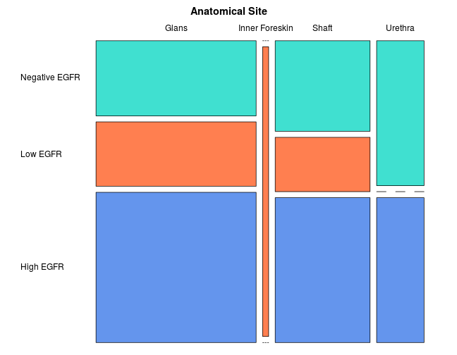 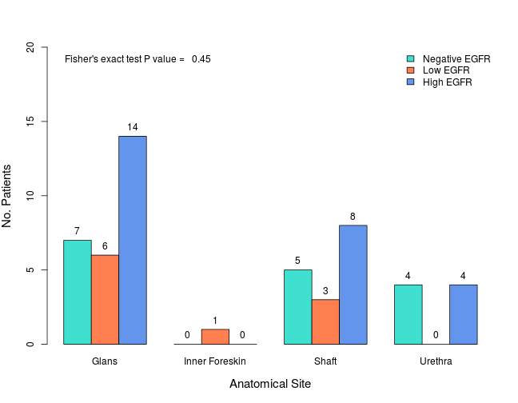 

***

#### Anatomical level and EGFR


Categorical Level | Negative EGFR | Low EGFR | High EGFR
--- | :---: | :---: | :---:
Lamina Propria | 4 (21.1) | 5 (26.3) | 10 (52.6)
CS/Dartos | 7 (46.7) | 3 (20) | 5 (33.3)
CC/Skin | 2 (20) | 1 (10) | 7 (70)
Urethra | 2 (33.3) | 1 (16.7) | 3 (30)
Other | 0 (0) | 0 (0) | 1 (100)

*No. missing cases: 1*

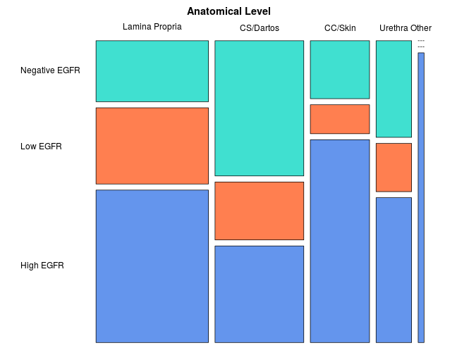 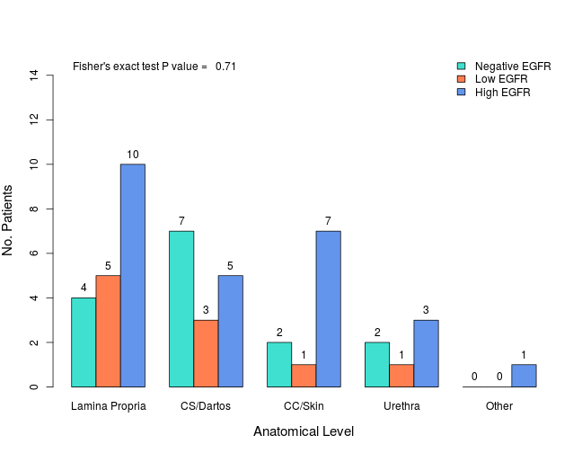 

***

#### Histologic grade and EGFR


Categorical Level | Negative EGFR | Low EGFR | High EGFR
--- | :---: | :---: | :---:
Grade 1 | 1 (10) | 2 (20) | 7 (70)
Grade 2 | 9 (37.5) | 4 (16.7) | 11 (45.8)
Grade 3 | 6 (33.3) | 4 (22.2) | 8 (44.4)

*No. missing cases: 0*

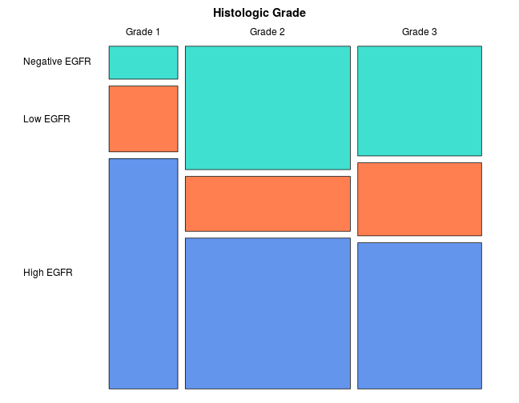 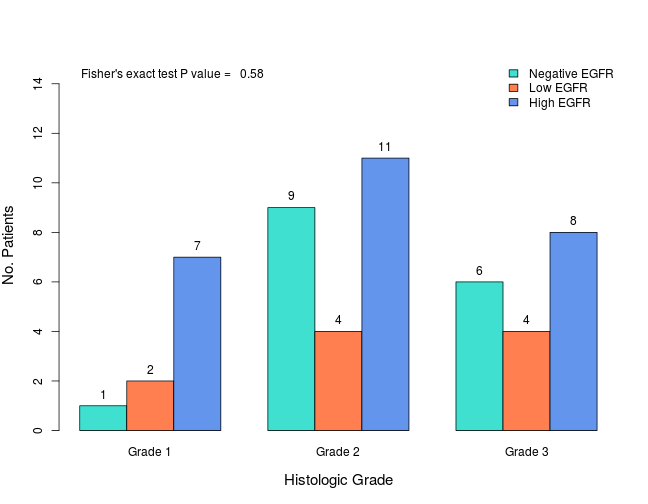 

***

#### Tumor thickness and EGFR


Categorical Level | Negative EGFR | Low EGFR | High EGFR
--- | :---: | :---: | :---:
Less than 5 mm | 6 (30) | 6 (30) | 8 (40)
5-10 mm | 4 (25) | 4 (25) | 8 (50)
More than 10 mm | 6 (37.5) | 0 (0) | 10 (62.5)

*No. missing cases: 0*

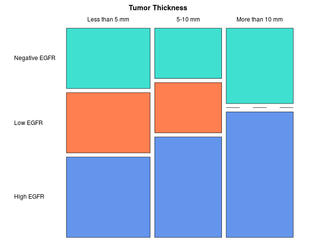 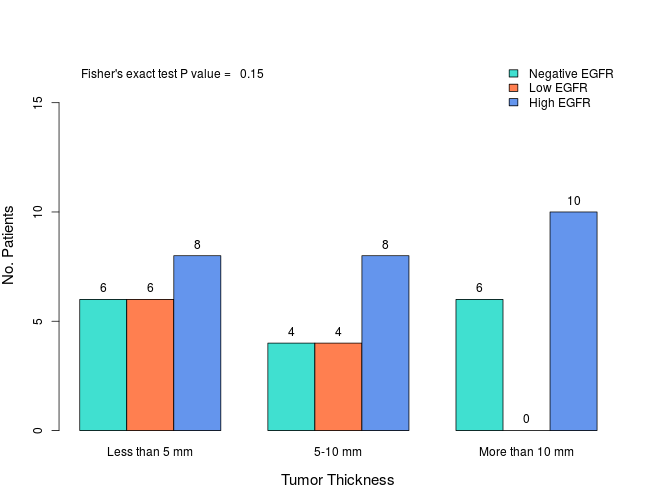 

***

#### Tumor invasion of penile urethra and EGFR


Categorical Level | Negative EGFR | Low EGFR | High EGFR
--- | :---: | :---: | :---:
No | 11 (26.2) | 10 (23.8) | 21 (50)
Yes | 5 (50) | 0 (0) | 5 (50)

*No. missing cases: 0*

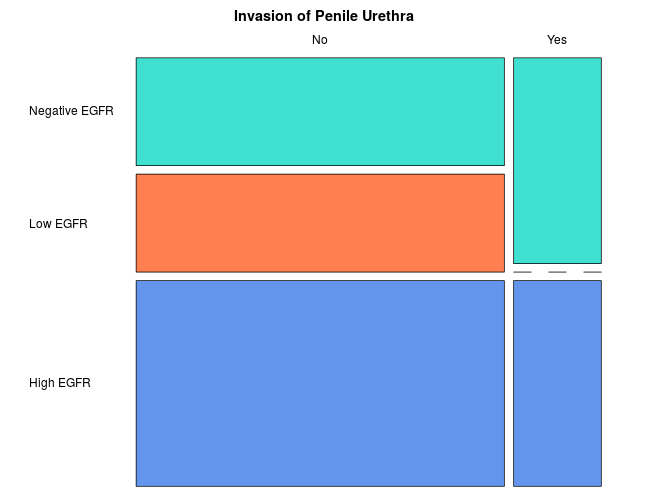 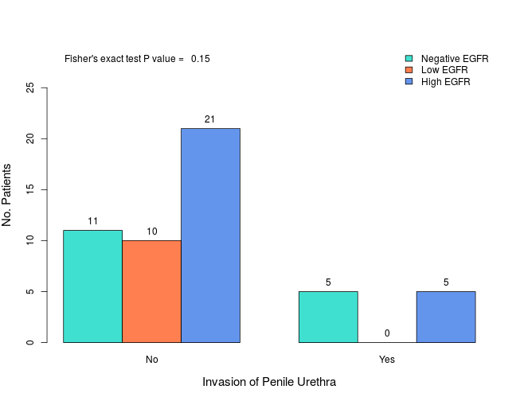 

***

#### Lymphovascular invasion and EGFR


Categorical Level | Negative EGFR | Low EGFR | High EGFR
--- | :---: | :---: | :---:
No | 8 (22.9) | 6 (17.1) | 21 (60)
Yes | 8 (47.1) | 4 (23.5) | 5 (29.4)

*No. missing cases: 0*

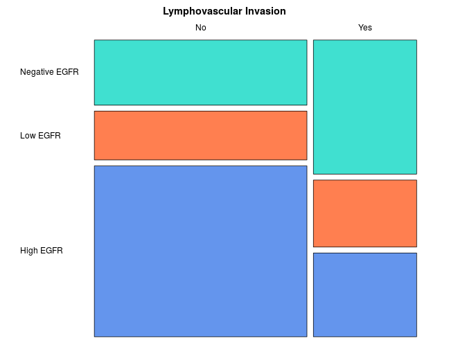 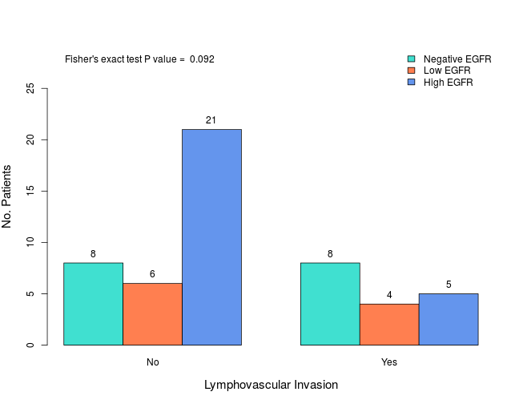 

***

#### Perineural invasion and EGFR


Categorical Level | Negative EGFR | Low EGFR | High EGFR
--- | :---: | :---: | :---:
No | 13 (37.1) | 9 (25.7) | 13 (37.1)
Yes | 3 (17.6) | 1 (5.9) | 13 (76.5)

*No. missing cases: 0*

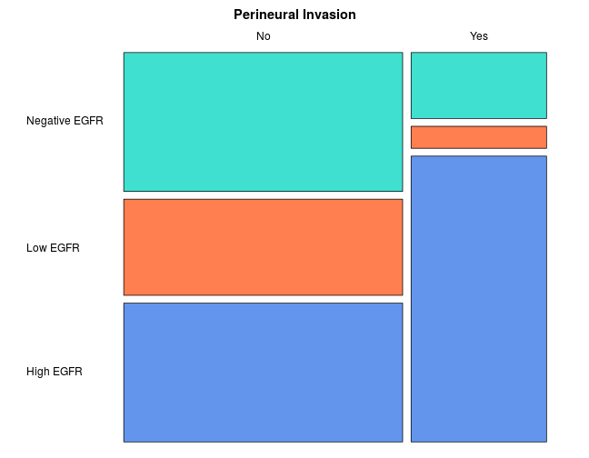 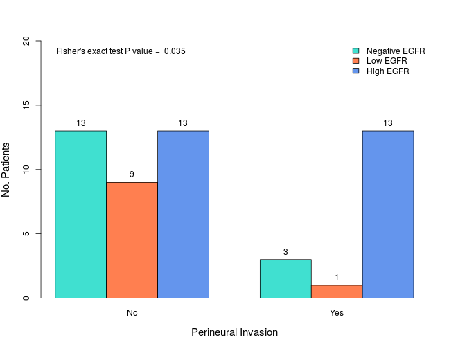 

***

#### Pathological T stage and EGFR


Categorical Level | Negative EGFR | Low EGFR | High EGFR
--- | :---: | :---: | :---:
Ta | 1 (100) | 0 (0) | 0 (0)
T1a | 3 (16.7) | 5 (27.8) | 10 (55.6)
T1b | 1 (100) | 0 (0) | 0 (0)
T2 | 9 (40.9) | 4 (18.2) | 9 (900)
T3 | 2 (22.2) | 1 (11.1) | 6 (66.7)
T4 | 0 (0) | 0 (0) | 1 (100)

*No. missing cases: 0*

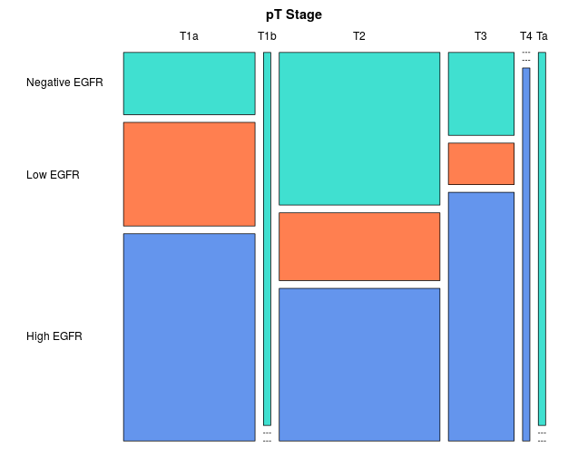 

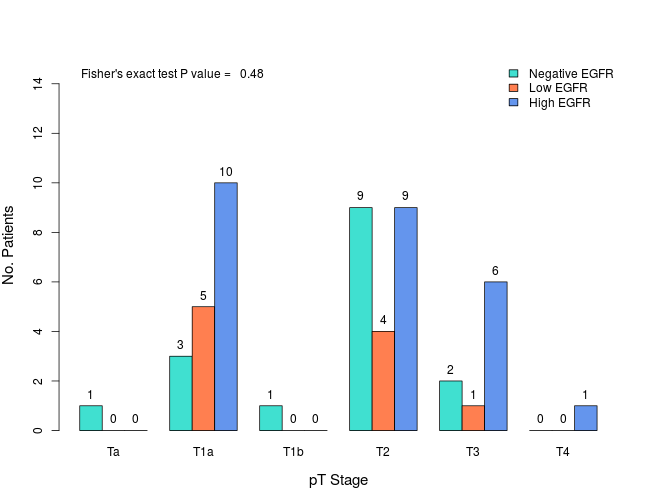 

***

#### Pathological N stage and EGFR


Categorical Level | Negative EGFR | Low EGFR | High EGFR
--- | :---: | :---: | :---:
pN0 | 4 (30.8) | 2 (15.4) | 7 (53.8)
pN1 | 2 (40) | 0 (0) | 3 (60)
pN2 | 2 (50) | 0 (0) | 2 (50)
pN3 | 4 (57.1) | 1 (14.3) | 2 (50)

*No. missing cases: 24*

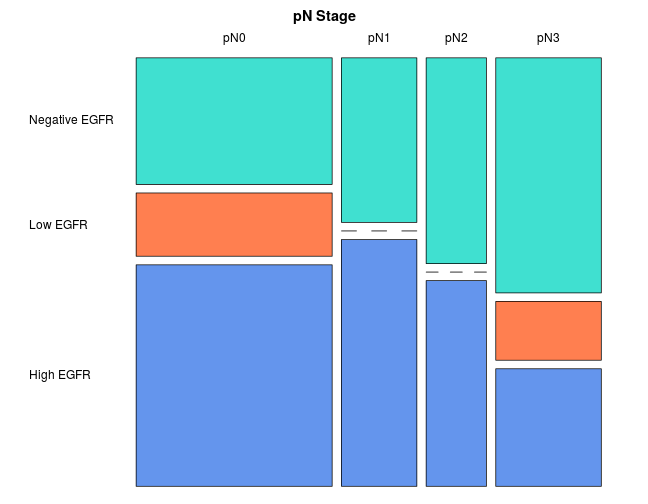 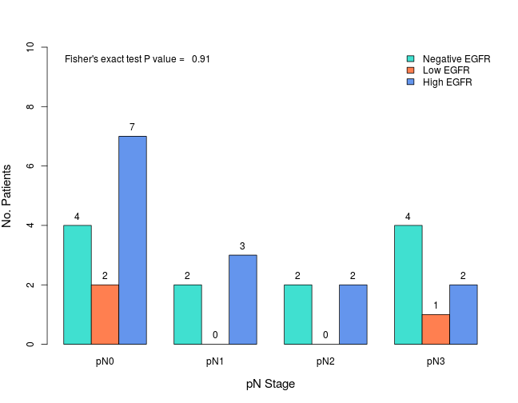 

***

#### Clinical stage and EGFR


Categorical Level | Negative EGFR | Low EGFR | High EGFR
--- | :---: | :---: | :---:
Stage 0 | 1 (100) | 0 (0) | 0 (0)
Stage I | 3 (17.6) | 5 (29.4) | 9 (52.9)
Stage II | 4 (22.2) | 4 (22.2) | 10 (55.6)
Stage IIIa | 2 (40) | 0 (0) | 3 (16.7)
Stage IIIb | 2 (100) | 0 (0) | 0 (0)
Stage IV | 4 (44.4) | 1 (11.1) | 4 (44.4)

*No. missing cases: 0*

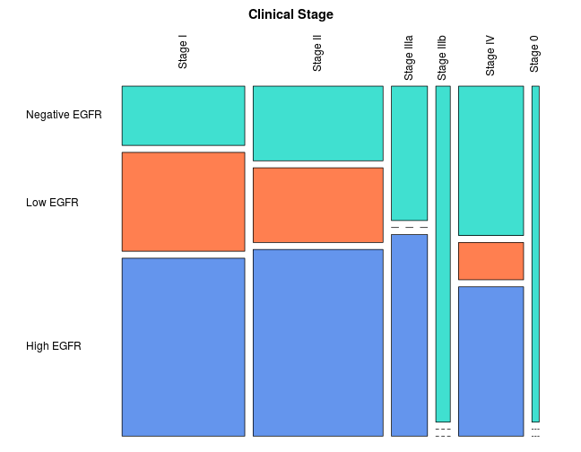 

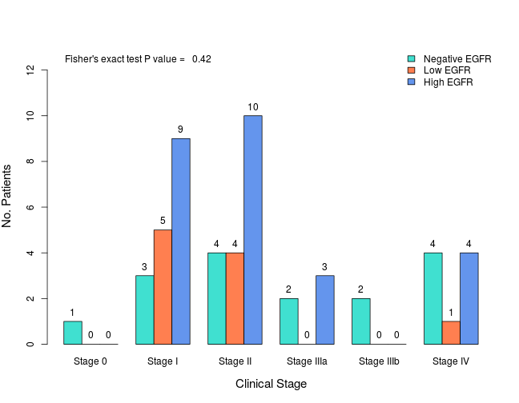 

***

#### Metastatic inguinal lymph nodes and EGFR


Categorical Level | Negative EGFR | Low EGFR | High EGFR
--- | :---: | :---: | :---:
Negative | 4 (30.8) | 2 (15.4) | 7 (53.8)
Positive | 8 (50) | 1 (6.2) | 7 (43.8)

*No. missing cases: 24*

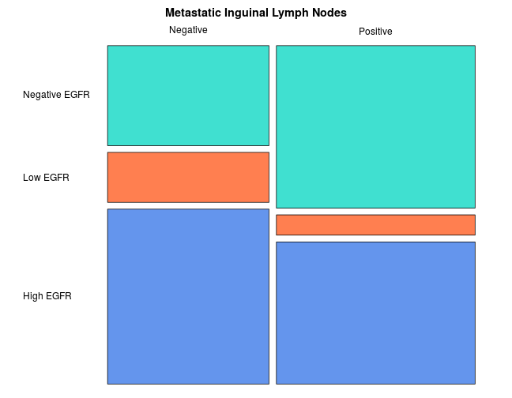 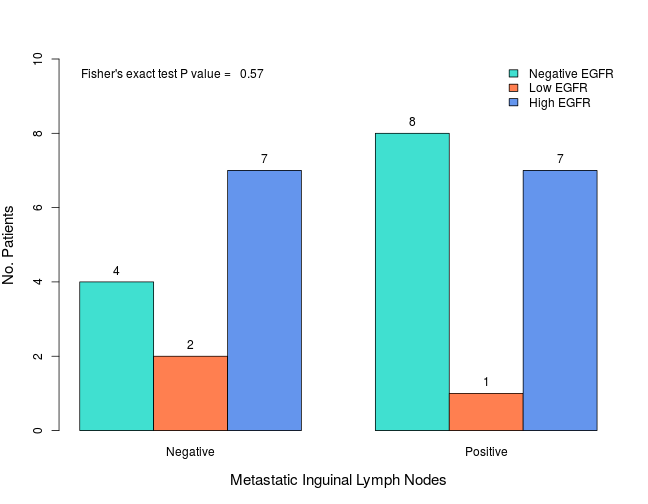 

***

### Outcome
#### Tumor recurrence and EGFR


Categorical Level | Negative EGFR | Low EGFR | High EGFR
--- | :---: | :---: | :---:
No | 15 (38.5) | 8 (20.5) | 16 (41)
Yes | 0 (0) | 1 (25) | 3 (75)

*No. missing cases: 9*

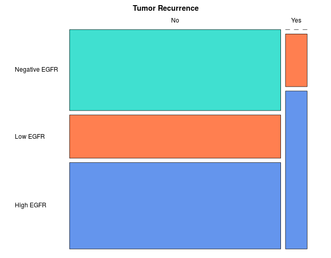  

***

#### Tumor progression and EGFR


Categorical Level | Negative EGFR | Low EGFR | High EGFR
--- | :---: | :---: | :---:
No | 9 (32.1) | 9 (32.1) | 10 (35.7)
Yes | 6 (33.3) | 0 (0) | 12 (66.7)

*No. missing cases: 6*

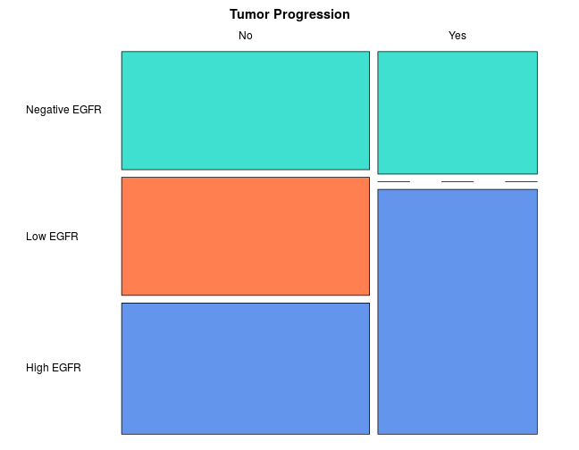 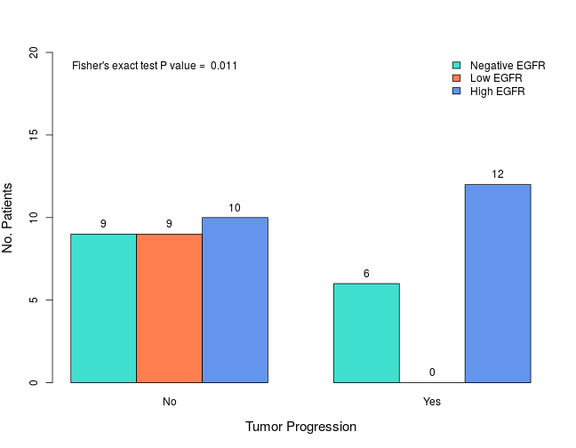 

***

#### Distant metastasis and EGFR


Categorical Level | Negative EGFR | Low EGFR | High EGFR
--- | :---: | :---: | :---:
No | 7 (28) | 8 (32) | 10 (40)
Yes | 9 (47.4) | 1 (5.3) | 9 (47.4)

*No. missing cases: 8*

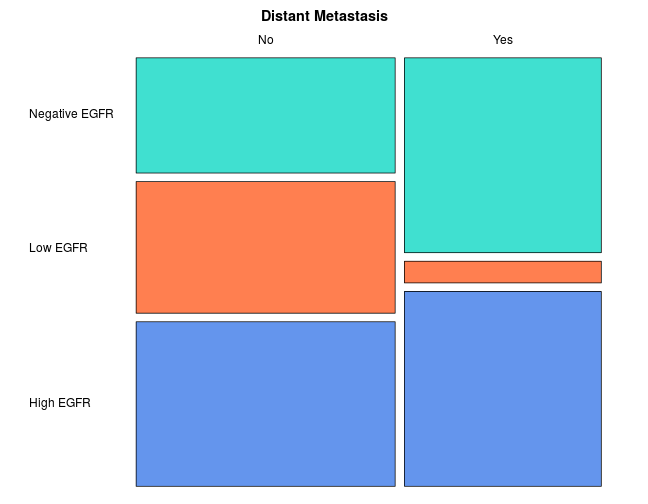 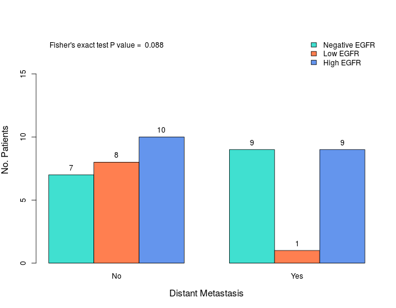 

***

#### Overall mortality and EGFR


Categorical Level | Negative EGFR | Low EGFR | High EGFR
--- | :---: | :---: | :---:
No | 8 (29.6) | 7 (25.9) | 12 (44.4)
Yes | 7 (30.4) | 3 (13) | 13 (56.5)

*No. missing cases: 2*

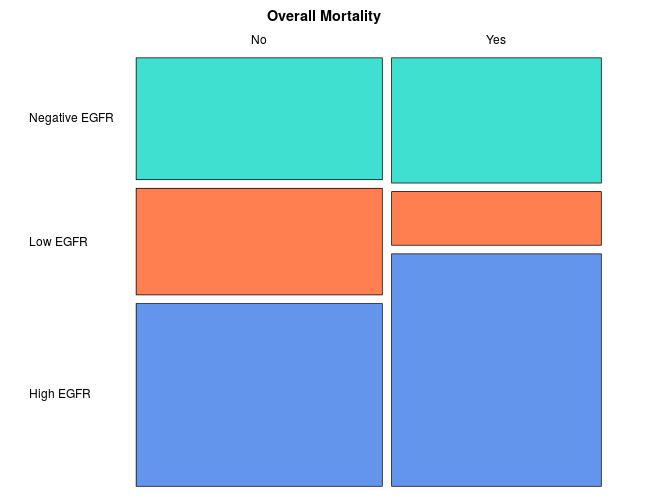 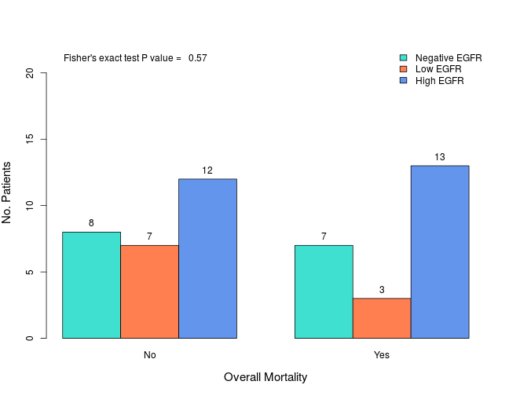 

***

#### Cancer-related mortalitynd EGFR


Categorical Level | Negative EGFR | Low EGFR | High EGFR
--- | :---: | :---: | :---:
No | 11 (27.5) | 10 (25) | 19 (47.5)
Yes | 3 (33.3) | 0 (0) | 6 (66.7)

*No. missing cases: 3*

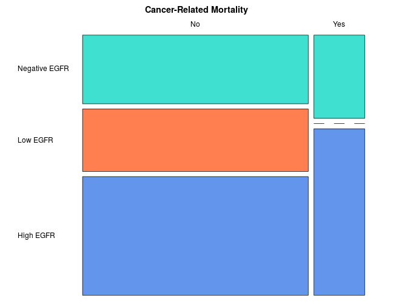 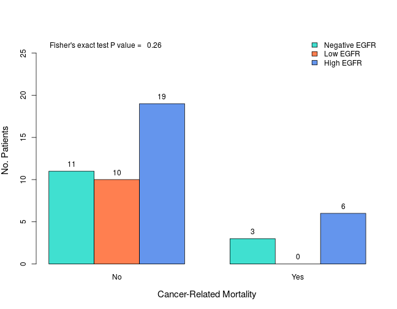 

***

### Adjusted P values


|Variables                       |Raw P values |Adjusted P values |
|:-------------------------------|:------------|:-----------------|
|Patient's age                   |0.86         |0.91              |
|Patient's race                  |0.87         |0.91              |
|Histologic subtype              |0.24         |0.91              |
|Anatomical site                 |0.45         |0.91              |
|Anatomical level                |0.71         |0.91              |
|Histologic grade                |0.58         |0.91              |
|Tumor thickness                 |0.15         |0.91              |
|Urethra invasion                |0.15         |0.91              |
|Lymphovascular invasion         |0.09         |0.91              |
|Perineural invasion             |0.04         |0.64              |
|Stage pT                        |0.48         |0.91              |
|Stage pN                        |0.91         |0.91              |
|Clinical stage                  |0.42         |0.91              |
|Metastatic inguinal lymph nodes |0.57         |0.91              |
|Tumor recurrence                |0.32         |0.91              |
|Tumor progression               |0.01         |0.19              |
|Distant metastasis              |0.09         |0.91              |
|Overall mortality               |0.57         |0.91              |
|Cancer-related mortality        |0.26         |0.91              |

***

## Survival Analysis
This section, currently under preparation, will include survival plots drawn using the Kapplan-Meier method and compared using the Mantel-Cox test.

***

## Odds Ratios
This section, currently under preparation, will report the odds ratios for outcome (tumor recurrence, tumor progression, distant metastasis, overall mortality, and cancer-related mortality) considering EGFR expression using unconditional logistic regression (unadjusted and adjusted) models.

***

## Hazard Ratios
This section, currently under preparation, will report the hazard ratios for outcome (tumor recurrence, tumor progression, distant metastasis, overall mortality, and cancer-related mortality) considering EGFR expression using Cox's proportional hazards regression (unadjusted and adjusted) models.
***
