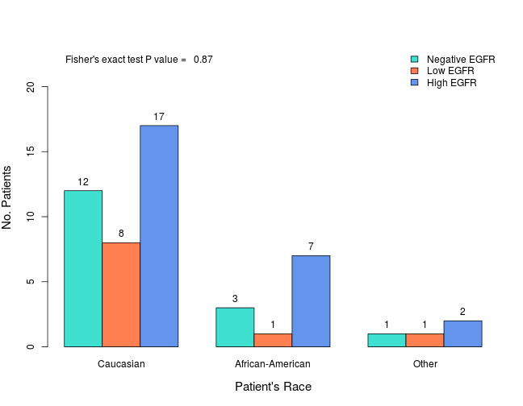

# EGFR Expression in Penile Cancer
Last update: ``Wed Sep 24 08:23:26 2014``


```r
library(knitr)
opts_chunk$set(echo = FALSE, message = FALSE, warning = FALSE, cache = FALSE, fig.width = 9, results = "asis")
```


***

## Descriptive Analysis

### Clinical Features

#### Patient's age


Statistics | Value
--- | :---:
Mean | 65.8
Standard Deviation | 12
Median | 65
Interquartile Range | 18
Minimum | 38
Maximum | 93

*No. missing cases: 0*

 

***

#### Patient's race


Categorical Level | No. Cases (%)
--- | :---:
Caucasian | 37 (69.8)
African-American | 12 (22.6)
Other | 4 (7.5)

*No. missing cases: 0*

 

***

### Pathologic Features

#### Histologic subtype


Categorical Level | No. Cases (%)
--- | :---:
Basaloid | 6 (11.3)
Others | 2 (3.8)
Papillary | 2 (3.8)
Usual | 33 (62.3)
Verrucous | 3 (5.7)
Warty | 5 (9.4)
WB | 2 (3.8)

*No. missing cases: 0*

 

***

#### Anatomical site


Categorical Level | No. Cases (%)
--- | :---:
Glans | 28 (52.8)
Inner Foreskin | 1 (1.9)
Shaft | 16 (30.2)
Urethra | 8 (15.1)

*No. missing cases: 0*

 

***

#### Anatomical level


Categorical Level | No. Cases (%)
--- | :---:
Lamina Propria | 20 (38.5)
CS/Dartos | 15 (28.8)
CC/Skin | 10 (19.2)
Urethra | 6 (11.5)
Other | 1 (1.9)

*No. missing cases: 1*

 

***

#### Histologic grade


Categorical Level | No. Cases (%)
--- | :---:
Grade 1 | 11 (20.8)
Grade 2 | 24 (45.3)
Grade 3 | 18 (34)

*No. missing cases: 0*

 

***

#### Tumor thickness


Categorical Level | No. Cases (%)
--- | :---:
Less than 5 mm | 21 (39.6)
5-10 mm | 16 (30.2)
More than 10 mm | 16 (30.2)

*No. missing cases: 0*

 

***

#### Tumor invasion of penile urethra


Categorical Level | No. Cases (%)
--- | :---:
No | 43 (81.1)
Yes | 10 (18.9)

*No. missing cases: 0*

 

***

#### Lymphovascular invasion


Categorical Level | No. Cases (%)
--- | :---:
No | 36 (67.9)
Yes | 17 (32.1)

*No. missing cases: 0*

 

***

#### Perineural invasion


Categorical Level | No. Cases (%)
--- | :---:
No | 36 (67.9)
Yes | 17 (32.1)

*No. missing cases: 0*

 

***

#### HPV infection


Categorical Level | No. Cases (%)
--- | :---:
No | 45 (84.9)
Yes | 8 (15.1)

*No. missing cases: 0*

 

***

#### Pathologic pT stage


Categorical Level | No. Cases (%)
--- | :---:
Stage Ta | 1 (1.9)
Stage T1a | 19 (35.8)
Stage T1b | 1 (1.9)
Stage T2 | 22 (41.5)
Stage T3 | 9 (17)
Stage T4 | 1 (1.9)

*No. missing cases: 0*

 

***

#### Pathologic pN stage


Categorical Level | No. Cases (%)
--- | :---:
Stage pN0 | 13 (44.8)
Stage pN1 | 5 (17.2)
Stage pN2 | 4 (13.8)
Stage pN3 | 7 (24.1)

*No. missing cases: 24*

 

***

#### Clinical stage


Categorical Level | No. Cases (%)
--- | :---:
Stage 0 | 1 (1.9)
Stage I | 18 (34)
Stage II | 18 (34)
Stage IIIa | 5 (9.4)
Stage IIIb | 2 (3.8)
Stage IV | 9 (17)

*No. missing cases: 0*

 

***

#### Inguinal lymph node dissection


Categorical Level | No. Cases (%)
--- | :---:
Prophylactic | 10 (45.5)
Post-Surgical | 12 (54.5)

*No. missing cases: 31*

 

***

#### Positive (metastatic) inguinal lymph nodes


Categorical Level | No. Cases (%)
--- | :---:
Negative | 13 (44.8)
Positive | 16 (55.2)

*No. missing cases: 24*

 

***

#### Time from treatment to lymphadenectomy


Statistics | Value
--- | :---:
Mean | 2.2
Standard Deviation | 3.8
Median | 1
Interquartile Range | 18
Minimum | 0
Maximum | 14.5

*No. missing cases: 31*

 

***

### Treatment
#### Primary treatment


Categorical Level | No. Cases (%)
--- | :---:
Partial Penectomy | 48 (90.6)
Pelvic Exenteration | 2 (3.8)
Shave Biopsy | 1 (1.9)
Total Penectomy | 2 (3.8)

*No. missing cases: 0*

 

***

#### Adjuvant chemotherapy


Categorical Level | No. Cases (%)
--- | :---:
No | 40 (87)
Yes | 6 (13)

*No. missing cases: 7*

 

***

#### Adjuvant radiotherapy


Categorical Level | No. Cases (%)
--- | :---:
No | 43 (87.8)
Yes | 6 (12.2)

*No. missing cases: 4*

 

***

### Outcome
#### Tumor recurrence


Categorical Level | No. Cases (%)
--- | :---:
No | 40 (90.9)
Yes | 4 (9.1)

*No. missing cases: 9*

 

***

#### Time from primary treatment to tumor recurrence


Statistics | Value
--- | :---:
Mean | 20.5
Standard Deviation | 23.7
Median | 13.3
Interquartile Range | 18
Minimum | 1
Maximum | 54.4

*No. missing cases: 49*

 

***

#### Tumor progression


Categorical Level | No. Cases (%)
--- | :---:
No | 29 (61.7)
Yes | 18 (38.3)

*No. missing cases: 6*

 

***

#### Time from primary treatment to tumor progression


Statistics | Value
--- | :---:
Mean | 9.8
Standard Deviation | 9
Median | 6
Interquartile Range | 18
Minimum | 0.2
Maximum | 31.4

*No. missing cases: 39*

 

***

#### Distant (visceral) metastasis


Categorical Level | No. Cases (%)
--- | :---:
No | 26 (57.8)
Yes | 19 (42.2)

*No. missing cases: 8*

 

***

#### Time from primary treatment to distant metastasis


Statistics | Value
--- | :---:
Mean | 9.8
Standard Deviation | 7
Median | 10.7
Interquartile Range | 18
Minimum | 1.3
Maximum | 19.4

*No. missing cases: 44*

 

***

#### Patient's outcome


Categorical Level | No. Cases (%)
--- | :---:
Died of Disease | 11 (20.8)
Died of other Causes | 15 (28.3)
Alive with Disease | 15 (18.9)
Alive with No Disease | 15 (30.2)
No Follow-Up | 15 (1.9)

*No. missing cases: 0*

 

***

#### Total follow-up time (months)


Statistics | Value
--- | :---:
Mean | 37.2
Standard Deviation | 43.5
Median | 17.9
Interquartile Range | 18
Minimum | 0.1
Maximum | 191.8

*No. missing cases: 2*

 

***

### EGFR expression
#### EGFR median score


Statistics | Value
--- | :---:
Mean | 8.3
Standard Deviation | 6
Median | 8.1
Interquartile Range | 18
Minimum | 0
Maximum | 20

*No. missing cases: 1*

 

***

#### EGFR categories


Categorical Level | No. Cases (%)
--- | :---:
Negative EGFR | 16 (30.8)
Low EGFR | 10 (19.2)
High EGFR | 26 (50)

*No. missing cases: 1*

 

***

## Association Analysis


### Clinical features
#### Patient's age and EGFR


Statistics | Negative EGFR | Low EGFR | High EGFR
--- | :---: | :---: | :---:
Mean | 64 | 67.8 | 65.8
Standard Deviation | 12.2 | 11.9 | 12.4
Median | 65.5 | 65 | 65
Interquartile Range | 18 | 20 | 17.5
Minimum | 38 | 56 | 39
Maximum | 80 | 87 | 93

*No. missing cases: 0*

 

***

#### Patient's race and EGFR


Categorical Level | Negative EGFR | Low EGFR | High EGFR
--- | :---: | :---: | :---:
Caucasian | 12 (32.4) | 8 (21.6) | 17 (45.9)
African-American | 3 (27.3) | 1 (9.1) | 7 (63.6)
Other | 1 (25) | 1 (25) | 2 (50)

*No. missing cases: 0*

  

***

### Pathologic features
#### Histologic subtype and EGFR


Categorical Level | Negative EGFR | Low EGFR | High EGFR
--- | :---: | :---: | :---:
Basaloid | 4 (66.7) | 1 (16.7) | 1 (16.7)
Others | 0 (0) | 1 (50) | 1 (50)
Papillary | 0 (0) | 0 (0) | 2 (100)
Usual | 8 (25) | 5 (15.6) | 19 (950)
Verrucous | 1 (33.3) | 1 (33.3) | 1 (33.3)
Warty | 3 (60) | 1 (20) | 1 (20)
WB | 0 (0) | 1 (50) | 1 (50)

*No. missing cases: 0*

 

 

***

#### Anatomical site and EGFR


Categorical Level | Negative EGFR | Low EGFR | High EGFR
--- | :---: | :---: | :---:
Glans | 7 (25.9) | 6 (22.2) | 14 (51.9)
Inner Foreskin | 0 (0) | 1 (100) | 0 (0)
Shaft | 5 (31.2) | 3 (18.8) | 8 (50)
Urethra | 4 (50) | 0 (0) | 4 (25)

*No. missing cases: 0*

  

***

#### Anatomical level and EGFR


Categorical Level | Negative EGFR | Low EGFR | High EGFR
--- | :---: | :---: | :---:
Lamina Propria | 4 (21.1) | 5 (26.3) | 10 (52.6)
CS/Dartos | 7 (46.7) | 3 (20) | 5 (33.3)
CC/Skin | 2 (20) | 1 (10) | 7 (70)
Urethra | 2 (33.3) | 1 (16.7) | 3 (30)
Other | 0 (0) | 0 (0) | 1 (100)

*No. missing cases: 1*

  

***

#### Histologic grade and EGFR


Categorical Level | Negative EGFR | Low EGFR | High EGFR
--- | :---: | :---: | :---:
Grade 1 | 1 (10) | 2 (20) | 7 (70)
Grade 2 | 9 (37.5) | 4 (16.7) | 11 (45.8)
Grade 3 | 6 (33.3) | 4 (22.2) | 8 (44.4)

*No. missing cases: 0*

  

***

#### Tumor thickness and EGFR


Categorical Level | Negative EGFR | Low EGFR | High EGFR
--- | :---: | :---: | :---:
Less than 5 mm | 6 (30) | 6 (30) | 8 (40)
5-10 mm | 4 (25) | 4 (25) | 8 (50)
More than 10 mm | 6 (37.5) | 0 (0) | 10 (62.5)

*No. missing cases: 0*

  

***

#### Tumor invasion of penile urethra and EGFR


Categorical Level | Negative EGFR | Low EGFR | High EGFR
--- | :---: | :---: | :---:
No | 11 (26.2) | 10 (23.8) | 21 (50)
Yes | 5 (50) | 0 (0) | 5 (50)

*No. missing cases: 0*

  

***

#### Lymphovascular invasion and EGFR


Categorical Level | Negative EGFR | Low EGFR | High EGFR
--- | :---: | :---: | :---:
No | 8 (22.9) | 6 (17.1) | 21 (60)
Yes | 8 (47.1) | 4 (23.5) | 5 (29.4)

*No. missing cases: 0*

  

***

#### Perineural invasion and EGFR


Categorical Level | Negative EGFR | Low EGFR | High EGFR
--- | :---: | :---: | :---:
No | 13 (37.1) | 9 (25.7) | 13 (37.1)
Yes | 3 (17.6) | 1 (5.9) | 13 (76.5)

*No. missing cases: 0*

  

***

#### Pathological T stage and EGFR


Categorical Level | Negative EGFR | Low EGFR | High EGFR
--- | :---: | :---: | :---:
Ta | 1 (100) | 0 (0) | 0 (0)
T1a | 3 (16.7) | 5 (27.8) | 10 (55.6)
T1b | 1 (100) | 0 (0) | 0 (0)
T2 | 9 (40.9) | 4 (18.2) | 9 (900)
T3 | 2 (22.2) | 1 (11.1) | 6 (66.7)
T4 | 0 (0) | 0 (0) | 1 (100)

*No. missing cases: 0*

 

 

***

#### Pathological N stage and EGFR


Categorical Level | Negative EGFR | Low EGFR | High EGFR
--- | :---: | :---: | :---:
pN0 | 4 (30.8) | 2 (15.4) | 7 (53.8)
pN1 | 2 (40) | 0 (0) | 3 (60)
pN2 | 2 (50) | 0 (0) | 2 (50)
pN3 | 4 (57.1) | 1 (14.3) | 2 (50)

*No. missing cases: 24*

  

***

#### Clinical stage and EGFR


Categorical Level | Negative EGFR | Low EGFR | High EGFR
--- | :---: | :---: | :---:
Stage 0 | 1 (100) | 0 (0) | 0 (0)
Stage I | 3 (17.6) | 5 (29.4) | 9 (52.9)
Stage II | 4 (22.2) | 4 (22.2) | 10 (55.6)
Stage IIIa | 2 (40) | 0 (0) | 3 (16.7)
Stage IIIb | 2 (100) | 0 (0) | 0 (0)
Stage IV | 4 (44.4) | 1 (11.1) | 4 (44.4)

*No. missing cases: 0*

 

 

***

#### Metastatic inguinal lymph nodes and EGFR


Categorical Level | Negative EGFR | Low EGFR | High EGFR
--- | :---: | :---: | :---:
Negative | 4 (30.8) | 2 (15.4) | 7 (53.8)
Positive | 8 (50) | 1 (6.2) | 7 (43.8)

*No. missing cases: 24*

  

***

### Outcome
#### Tumor recurrence and EGFR


Categorical Level | Negative EGFR | Low EGFR | High EGFR
--- | :---: | :---: | :---:
No | 15 (38.5) | 8 (20.5) | 16 (41)
Yes | 0 (0) | 1 (25) | 3 (75)

*No. missing cases: 9*

  

***

#### Tumor progression and EGFR


Categorical Level | Negative EGFR | Low EGFR | High EGFR
--- | :---: | :---: | :---:
No | 9 (32.1) | 9 (32.1) | 10 (35.7)
Yes | 6 (33.3) | 0 (0) | 12 (66.7)

*No. missing cases: 6*

  

***

#### Distant metastasis and EGFR


Categorical Level | Negative EGFR | Low EGFR | High EGFR
--- | :---: | :---: | :---:
No | 7 (28) | 8 (32) | 10 (40)
Yes | 9 (47.4) | 1 (5.3) | 9 (47.4)

*No. missing cases: 8*

  

***

#### Overall mortality and EGFR


Categorical Level | Negative EGFR | Low EGFR | High EGFR
--- | :---: | :---: | :---:
No | 8 (29.6) | 7 (25.9) | 12 (44.4)
Yes | 7 (30.4) | 3 (13) | 13 (56.5)

*No. missing cases: 2*

  

***

#### Cancer-related mortalitynd EGFR


Categorical Level | Negative EGFR | Low EGFR | High EGFR
--- | :---: | :---: | :---:
No | 11 (27.5) | 10 (25) | 19 (47.5)
Yes | 3 (33.3) | 0 (0) | 6 (66.7)

*No. missing cases: 3*

  

***

### Adjusted P values


|Variables                       |Raw P values |Adjusted P values |
|:-------------------------------|:------------|:-----------------|
|Patient's age                   |0.86         |0.91              |
|Patient's race                  |0.87         |0.91              |
|Histologic subtype              |0.24         |0.91              |
|Anatomical site                 |0.45         |0.91              |
|Anatomical level                |0.71         |0.91              |
|Histologic grade                |0.58         |0.91              |
|Tumor thickness                 |0.15         |0.91              |
|Urethra invasion                |0.15         |0.91              |
|Lymphovascular invasion         |0.09         |0.91              |
|Perineural invasion             |0.04         |0.64              |
|Stage pT                        |0.48         |0.91              |
|Stage pN                        |0.91         |0.91              |
|Clinical stage                  |0.42         |0.91              |
|Metastatic inguinal lymph nodes |0.57         |0.91              |
|Tumor recurrence                |0.32         |0.91              |
|Tumor progression               |0.01         |0.19              |
|Distant metastasis              |0.09         |0.91              |
|Overall mortality               |0.57         |0.91              |
|Cancer-related mortality        |0.26         |0.91              |

***

## Survival Analysis
This section, currently under preparation, will include survival plots drawn using the Kapplan-Meier method and compared using the Mantel-Cox test.

***

## Odds Ratios
This section, currently under preparation, will report the odds ratios for outcome (tumor recurrence, tumor progression, distant metastasis, overall mortality, and cancer-related mortality) considering EGFR expression using unconditional logistic regression (unadjusted and adjusted) models.

***

## Hazard Ratios
This section, currently under preparation, will report the hazard ratios for outcome (tumor recurrence, tumor progression, distant metastasis, overall mortality, and cancer-related mortality) considering EGFR expression using Cox's proportional hazards regression (unadjusted and adjusted) models.
***
