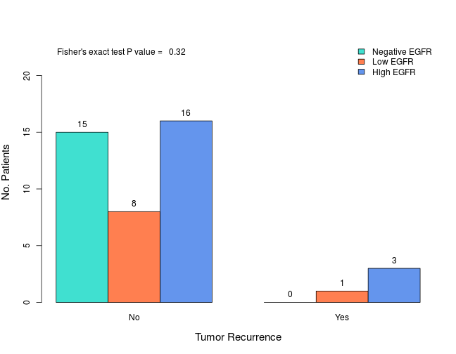
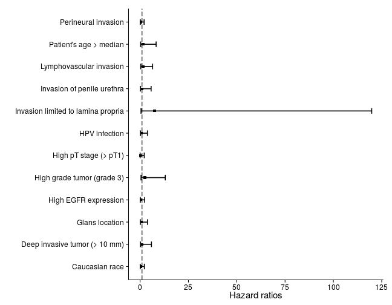

# EGFR Expression in Penile Cancer
Last update: ``Tue Sep 30 21:34:03 2014``


```r
library(knitr)
opts_chunk$set(echo = FALSE, message = FALSE, warning = FALSE, fig.width = 9, results = "asis")
```


***

## Descriptive Analysis

### Clinical Features

#### Patient's age


Statistics | Value
--- | :---:
Mean | 65.8
Standard deviation | 12
Median | 65
Interquartile range | 18
Minimum | 38
Maximum | 93

*No. missing cases: 0*

 

***

#### Patient's race


Categorical Level | No. Cases (%)
--- | :---:
Caucasian | 37 (69.8)
African-American | 12 (22.6)
Other | 4 (7.5)

*No. missing cases: 0*

 

***

### Pathologic Features

#### Histologic subtype


Categorical Level | No. Cases (%)
--- | :---:
Basaloid | 6 (11.3)
Others | 2 (3.8)
Papillary | 2 (3.8)
Usual | 33 (62.3)
Verrucous | 3 (5.7)
Warty | 5 (9.4)
WB | 2 (3.8)

*No. missing cases: 0*

 

***

#### Anatomical site


Categorical Level | No. Cases (%)
--- | :---:
Glans | 28 (52.8)
Inner Foreskin | 1 (1.9)
Shaft | 16 (30.2)
Urethra | 8 (15.1)

*No. missing cases: 0*

 

***

#### Anatomical level


Categorical Level | No. Cases (%)
--- | :---:
Lamina Propria | 20 (38.5)
CS/Dartos | 15 (28.8)
CC/Skin | 10 (19.2)
Urethra | 6 (11.5)
Other | 1 (1.9)

*No. missing cases: 1*

 

***

#### Histologic grade


Categorical Level | No. Cases (%)
--- | :---:
Grade 1 | 11 (20.8)
Grade 2 | 24 (45.3)
Grade 3 | 18 (34)

*No. missing cases: 0*

 

***

#### Tumor thickness


Categorical Level | No. Cases (%)
--- | :---:
Less than 5 mm | 21 (39.6)
5-10 mm | 16 (30.2)
More than 10 mm | 16 (30.2)

*No. missing cases: 0*

 

***

#### Tumor invasion of penile urethra


Categorical Level | No. Cases (%)
--- | :---:
No | 43 (81.1)
Yes | 10 (18.9)

*No. missing cases: 0*

 

***

#### Lymphovascular invasion


Categorical Level | No. Cases (%)
--- | :---:
No | 36 (67.9)
Yes | 17 (32.1)

*No. missing cases: 0*

 

***

#### Perineural invasion


Categorical Level | No. Cases (%)
--- | :---:
No | 36 (67.9)
Yes | 17 (32.1)

*No. missing cases: 0*

 

***

#### HPV infection


Categorical Level | No. Cases (%)
--- | :---:
No | 45 (84.9)
Yes | 8 (15.1)

*No. missing cases: 0*

 

***

#### Pathologic pT stage


Categorical Level | No. Cases (%)
--- | :---:
Ta | 1 (1.9)
T1a | 19 (35.8)
T1b | 1 (1.9)
T2 | 22 (41.5)
T3 | 9 (17)
T4 | 1 (1.9)

*No. missing cases: 0*

 

***

#### Pathologic pN stage


Categorical Level | No. Cases (%)
--- | :---:
pN0 | 13 (44.8)
pN1 | 5 (17.2)
pN2 | 4 (13.8)
pN3 | 7 (24.1)

*No. missing cases: 24*

 

***

#### Clinical stage


Categorical Level | No. Cases (%)
--- | :---:
Stage 0 | 1 (1.9)
Stage I | 18 (34)
Stage II | 18 (34)
Stage IIIa | 5 (9.4)
Stage IIIb | 2 (3.8)
Stage IV | 9 (17)

*No. missing cases: 0*

 

***

#### Inguinal lymph node dissection


Categorical Level | No. Cases (%)
--- | :---:
Prophylactic | 10 (45.5)
Post-Surgical | 12 (54.5)

*No. missing cases: 31*

 

***

#### Positive (metastatic) inguinal lymph nodes


Categorical Level | No. Cases (%)
--- | :---:
Negative | 13 (44.8)
Positive | 16 (55.2)

*No. missing cases: 24*

 

***

#### Time from treatment to lymphadenectomy


Statistics | Value
--- | :---:
Mean | 2.2
Standard deviation | 3.8
Median | 1
Interquartile range | 1.7
Minimum | 0
Maximum | 14.5

*No. missing cases: 31*

 

***

### Treatment
#### Primary treatment


Categorical Level | No. Cases (%)
--- | :---:
Partial Penectomy | 48 (90.6)
Pelvic Exenteration | 2 (3.8)
Shave Biopsy | 1 (1.9)
Total Penectomy | 2 (3.8)

*No. missing cases: 0*

 

***

#### Adjuvant chemotherapy


Categorical Level | No. Cases (%)
--- | :---:
No | 40 (87)
Yes | 6 (13)

*No. missing cases: 7*

 

***

#### Adjuvant radiotherapy


Categorical Level | No. Cases (%)
--- | :---:
No | 43 (87.8)
Yes | 6 (12.2)

*No. missing cases: 4*

 

***

### Outcome
#### Tumor recurrence


Categorical Level | No. Cases (%)
--- | :---:
No | 40 (90.9)
Yes | 4 (9.1)

*No. missing cases: 9*

 

***

#### Time from primary treatment to tumor recurrence


Statistics | Value
--- | :---:
Mean | 20.5
Standard deviation | 23.7
Median | 13.3
Interquartile range | 20.8
Minimum | 1
Maximum | 54.4

*No. missing cases: 49*

 

***

#### Tumor progression


Categorical Level | No. Cases (%)
--- | :---:
No | 29 (61.7)
Yes | 18 (38.3)

*No. missing cases: 6*

 

***

#### Time from primary treatment to tumor progression


Statistics | Value
--- | :---:
Mean | 9.8
Standard deviation | 9
Median | 6
Interquartile range | 13.3
Minimum | 0.2
Maximum | 31.4

*No. missing cases: 39*

 

***

#### Distant (visceral) metastasis


Categorical Level | No. Cases (%)
--- | :---:
No | 26 (57.8)
Yes | 19 (42.2)

*No. missing cases: 8*

 

***

#### Time from primary treatment to distant metastasis


Statistics | Value
--- | :---:
Mean | 9.8
Standard deviation | 7
Median | 10.7
Interquartile range | 13.1
Minimum | 1.3
Maximum | 19.4

*No. missing cases: 44*

 

***

#### Patient's outcome


Categorical Level | No. Cases (%)
--- | :---:
Died of Disease | 11 (20.8)
Died of other Causes | 15 (28.3)
Alive with Disease | 10 (18.9)
Alive with No Disease | 16 (30.2)
No Follow-Up | 1 (1.9)

*No. missing cases: 0*

 

***

#### Total follow-up time (months)


Statistics | Value
--- | :---:
Mean | 37.2
Standard deviation | 43.5
Median | 17.9
Interquartile range | 47.2
Minimum | 0.1
Maximum | 191.8

*No. missing cases: 2*

 

***

### EGFR expression
#### EGFR median score


Statistics | Value
--- | :---:
Mean | 8.3
Standard deviation | 6
Median | 8.1
Interquartile range | 10.1
Minimum | 0
Maximum | 20

*No. missing cases: 1*

 

***

#### EGFR categories


Categorical Level | No. Cases (%)
--- | :---:
Negative EGFR | 16 (30.8)
Low EGFR | 10 (19.2)
High EGFR | 26 (50)

*No. missing cases: 1*

 

***

## Association Analysis


### Clinical features
#### Patient's age and EGFR


Statistics | Negative EGFR | Low EGFR | High EGFR
--- | :---: | :---: | :---:
Mean | 64 | 67.8 | 65.8
Standard deviation | 12.2 | 11.9 | 12.4
Median | 65.5 | 65 | 65
Interquartile range | 18 | 20 | 17.5
Minimum | 38 | 56 | 39
Maximum | 80 | 87 | 93

*No. missing cases: 0*

 

***

#### Patient's race and EGFR


Categorical Level | Negative EGFR | Low EGFR | High EGFR
--- | :---: | :---: | :---:
Caucasian | 12 (32.4) | 8 (21.6) | 17 (45.9)
African-American | 3 (27.3) | 1 (9.1) | 7 (63.6)
Other | 1 (25) | 1 (25) | 2 (50)

*No. missing cases: 0*

  

***

### Pathologic features
#### Histologic subtype and EGFR


Categorical Level | Negative EGFR | Low EGFR | High EGFR
--- | :---: | :---: | :---:
Basaloid | 4 (66.7) | 1 (16.7) | 1 (16.7)
Others | 0 (0) | 1 (50) | 1 (50)
Papillary | 0 (0) | 0 (0) | 2 (100)
Usual | 8 (25) | 5 (15.6) | 19 (950)
Verrucous | 1 (33.3) | 1 (33.3) | 1 (33.3)
Warty | 3 (60) | 1 (20) | 1 (20)
WB | 0 (0) | 1 (50) | 1 (50)

*No. missing cases: 0*

 

 

***

#### Anatomical site and EGFR


Categorical Level | Negative EGFR | Low EGFR | High EGFR
--- | :---: | :---: | :---:
Glans | 7 (25.9) | 6 (22.2) | 14 (51.9)
Inner Foreskin | 0 (0) | 1 (100) | 0 (0)
Shaft | 5 (31.2) | 3 (18.8) | 8 (50)
Urethra | 4 (50) | 0 (0) | 4 (25)

*No. missing cases: 0*

  

***

#### Anatomical level and EGFR


Categorical Level | Negative EGFR | Low EGFR | High EGFR
--- | :---: | :---: | :---:
Lamina Propria | 4 (21.1) | 5 (26.3) | 10 (52.6)
CS/Dartos | 7 (46.7) | 3 (20) | 5 (33.3)
CC/Skin | 2 (20) | 1 (10) | 7 (70)
Urethra | 2 (33.3) | 1 (16.7) | 3 (30)
Other | 0 (0) | 0 (0) | 1 (100)

*No. missing cases: 1*

  

***

#### Histologic grade and EGFR


Categorical Level | Negative EGFR | Low EGFR | High EGFR
--- | :---: | :---: | :---:
Grade 1 | 1 (10) | 2 (20) | 7 (70)
Grade 2 | 9 (37.5) | 4 (16.7) | 11 (45.8)
Grade 3 | 6 (33.3) | 4 (22.2) | 8 (44.4)

*No. missing cases: 0*

  

***

#### Tumor thickness and EGFR


Categorical Level | Negative EGFR | Low EGFR | High EGFR
--- | :---: | :---: | :---:
Less than 5 mm | 6 (30) | 6 (30) | 8 (40)
5-10 mm | 4 (25) | 4 (25) | 8 (50)
More than 10 mm | 6 (37.5) | 0 (0) | 10 (62.5)

*No. missing cases: 0*

  

***

#### Tumor invasion of penile urethra and EGFR


Categorical Level | Negative EGFR | Low EGFR | High EGFR
--- | :---: | :---: | :---:
No | 11 (26.2) | 10 (23.8) | 21 (50)
Yes | 5 (50) | 0 (0) | 5 (50)

*No. missing cases: 0*

  

***

#### Lymphovascular invasion and EGFR


Categorical Level | Negative EGFR | Low EGFR | High EGFR
--- | :---: | :---: | :---:
No | 8 (22.9) | 6 (17.1) | 21 (60)
Yes | 8 (47.1) | 4 (23.5) | 5 (29.4)

*No. missing cases: 0*

  

***

#### Perineural invasion and EGFR


Categorical Level | Negative EGFR | Low EGFR | High EGFR
--- | :---: | :---: | :---:
No | 13 (37.1) | 9 (25.7) | 13 (37.1)
Yes | 3 (17.6) | 1 (5.9) | 13 (76.5)

*No. missing cases: 0*

  

***

#### Pathological T stage and EGFR


Categorical Level | Negative EGFR | Low EGFR | High EGFR
--- | :---: | :---: | :---:
Ta | 1 (100) | 0 (0) | 0 (0)
T1a | 3 (16.7) | 5 (27.8) | 10 (55.6)
T1b | 1 (100) | 0 (0) | 0 (0)
T2 | 9 (40.9) | 4 (18.2) | 9 (900)
T3 | 2 (22.2) | 1 (11.1) | 6 (66.7)
T4 | 0 (0) | 0 (0) | 1 (100)

*No. missing cases: 0*

 

 

***

#### Pathological N stage and EGFR


Categorical Level | Negative EGFR | Low EGFR | High EGFR
--- | :---: | :---: | :---:
pN0 | 4 (30.8) | 2 (15.4) | 7 (53.8)
pN1 | 2 (40) | 0 (0) | 3 (60)
pN2 | 2 (50) | 0 (0) | 2 (50)
pN3 | 4 (57.1) | 1 (14.3) | 2 (50)

*No. missing cases: 24*

  

***

#### Clinical stage and EGFR


Categorical Level | Negative EGFR | Low EGFR | High EGFR
--- | :---: | :---: | :---:
Stage 0 | 1 (100) | 0 (0) | 0 (0)
Stage I | 3 (17.6) | 5 (29.4) | 9 (52.9)
Stage II | 4 (22.2) | 4 (22.2) | 10 (55.6)
Stage IIIa | 2 (40) | 0 (0) | 3 (16.7)
Stage IIIb | 2 (100) | 0 (0) | 0 (0)
Stage IV | 4 (44.4) | 1 (11.1) | 4 (44.4)

*No. missing cases: 0*

 

 

***

#### Metastatic inguinal lymph nodes and EGFR


Categorical Level | Negative EGFR | Low EGFR | High EGFR
--- | :---: | :---: | :---:
Negative | 4 (30.8) | 2 (15.4) | 7 (53.8)
Positive | 8 (50) | 1 (6.2) | 7 (43.8)

*No. missing cases: 24*

  

***

### Outcome
#### Tumor recurrence and EGFR


Categorical Level | Negative EGFR | Low EGFR | High EGFR
--- | :---: | :---: | :---:
No | 15 (38.5) | 8 (20.5) | 16 (41)
Yes | 0 (0) | 1 (25) | 3 (75)

*No. missing cases: 9*

  

***

#### Tumor progression and EGFR


Categorical Level | Negative EGFR | Low EGFR | High EGFR
--- | :---: | :---: | :---:
No | 9 (32.1) | 9 (32.1) | 10 (35.7)
Yes | 6 (33.3) | 0 (0) | 12 (66.7)

*No. missing cases: 6*

  

***

#### Distant metastasis and EGFR


Categorical Level | Negative EGFR | Low EGFR | High EGFR
--- | :---: | :---: | :---:
No | 7 (28) | 8 (32) | 10 (40)
Yes | 9 (47.4) | 1 (5.3) | 9 (47.4)

*No. missing cases: 8*

  

***

#### Overall mortality and EGFR


Categorical Level | Negative EGFR | Low EGFR | High EGFR
--- | :---: | :---: | :---:
No | 8 (29.6) | 7 (25.9) | 12 (44.4)
Yes | 7 (30.4) | 3 (13) | 13 (56.5)

*No. missing cases: 2*

  

***

#### Cancer-related mortality and EGFR


Categorical Level | Negative EGFR | Low EGFR | High EGFR
--- | :---: | :---: | :---:
No | 11 (27.5) | 10 (25) | 19 (47.5)
Yes | 3 (33.3) | 0 (0) | 6 (66.7)

*No. missing cases: 3*

  

***

### Adjusted P values


|Variables                       | Raw P values | Adjusted P values |
|:-------------------------------|:------------:|:-----------------:|
|Patient's age                   |     0.86     |       0.91        |
|Patient's race                  |     0.87     |       0.91        |
|Histologic subtype              |     0.24     |       0.91        |
|Anatomical site                 |     0.45     |       0.91        |
|Anatomical level                |     0.71     |       0.91        |
|Histologic grade                |     0.58     |       0.91        |
|Tumor thickness                 |     0.15     |       0.91        |
|Urethra invasion                |     0.15     |       0.91        |
|Lymphovascular invasion         |     0.09     |       0.91        |
|Perineural invasion             |     0.04     |       0.64        |
|Stage pT                        |     0.48     |       0.91        |
|Stage pN                        |     0.91     |       0.91        |
|Clinical stage                  |     0.42     |       0.91        |
|Metastatic inguinal lymph nodes |     0.57     |       0.91        |
|Tumor recurrence                |     0.32     |       0.91        |
|Tumor progression               |     0.01     |       0.19        |
|Distant metastasis              |     0.09     |       0.91        |
|Overall mortality               |     0.57     |       0.91        |
|Cancer-related mortality        |     0.26     |       0.91        |

***

## Survival Analysis
This section includes survival plots drawn using the Kapplan-Meier method and compared using the Mantel-Cox test, for each of the following outcomes: tumor recurrence, tumor progression, distant metastasis, overall mortality, and cancer-related mortality.

### Tumor recurrence


Follow-up on tumor recurrence | Negative EGFR | Low EGFR | High EGFR
--- | :---: | :---: | :---:
No | 16 (33.3) | 9 (18.8) | 23 (47.9)
Yes | 0 (0) | 1 (25) | 3 (75)

 

### Tumor progression


Follow-up on tumor progression | Negative EGFR | Low EGFR | High EGFR
--- | :---: | :---: | :---:
No | 12 (31.6) | 10 (26.3) | 16 (42.1)
Yes | 4 (28.6) | 0 (0) | 10 (71.4)

 

### Distant metastasis


Follow-up on distant metastasis | Negative EGFR | Low EGFR | High EGFR
--- | :---: | :---: | :---:
No | 13 (30.2) | 10 (23.3) | 20 (46.5)
Yes | 3 (33.3) | 0 (0) | 6 (66.7)

 

### Overall mortality


Follow-up on overall mortality | Negative EGFR | Low EGFR | High EGFR
--- | :---: | :---: | :---:
No | 1 (50) | 0 (0) | 1 (50)
Yes | 15 (30) | 10 (20) | 25 (50)

 

### Cancer-specific mortality


Follow-up on cancer-specific mortality | Negative EGFR | Low EGFR | High EGFR
--- | :---: | :---: | :---:
No | 1 (50) | 0 (0) | 1 (50)
Yes | 15 (30) | 10 (20) | 25 (50)

 

***

## Odds Ratios
This section reports the odds ratios (OR) for outcome (tumor recurrence, tumor progression, distant metastasis, overall mortality, and cancer-related mortality) considering EGFR expression (high vs. low/negative) using unconditional logistic regression models. Variables with extremely low or extremely high OR were dropped from the report.


### Tumor recurrence
#### Odds ratios for tumor recurrence

|Variable                           |  OR  | Lower 95% CI | Upper 95% CI | P value |
|:----------------------------------|:----:|:------------:|:------------:|:-------:|
|Patient's age > median             | 0.27 |     0.01     |     2.34     | 0.2779  |
|Glans location                     | 0.67 |     0.07     |     6.02     | 0.6996  |
|Invasion limited to lamina propria | 1.79 |     0.2      |    16.25     | 0.5823  |
|Deep invasive tumor (> 10 mm)      | 0.78 |     0.04     |     6.8      | 0.8348  |
|Lymphovascular invasion            | 2.08 |     0.23     |    18.95     | 0.4886  |
|Perineural invasion                | 0.69 |     0.03     |     6.02     | 0.7599  |
|HPV infection                      | 5.67 |     0.59     |    55.58     | 0.1127  |
|High pT stage (> pT1)              | 0.6  |     0.07     |     5.43     | 0.6273  |
|High pN stage (> pN0)              | 0.75 |     0.03     |    20.72     |  0.846  |
|High clinical stage (> Stage II)   | 0.78 |     0.04     |     6.8      | 0.8348  |
|Metastatic inguinal lymph nodes    | 0.75 |     0.03     |    20.72     |  0.846  |
|High EGFR expression               | 4.31 |     0.5      |    91.62     | 0.2231  |

<small>The following variables were dropped: caucasian race, high grade tumor (grade 3), invasion of penile urethra, and prophylactic inguinal lymph node dissection.</small><br><br>

#### Forest plot for tumor recurrence
 

***

### Tumor progression
#### Odds ratios for tumor progression

|Variable                                    |  OR   | Lower 95% CI | Upper 95% CI | P value |
|:-------------------------------------------|:-----:|:------------:|:------------:|:-------:|
|Patient's age > median                      | 0.65  |     0.19     |     2.11     | 0.4755  |
|Caucasian race                              | 1.57  |     0.42     |     6.76     | 0.5132  |
|Glans location                              | 0.23  |     0.06     |     0.76     |  0.02   |
|Invasion limited to lamina propria          | 0.13  |     0.02     |     0.55     | 0.0133  |
|High grade tumor (grade 3)                  | 3.28  |     0.97     |    11.77     | 0.0595  |
|Deep invasive tumor (> 10 mm)               | 22.53 |     5.22     |    130.3     |  1e-04  |
|Invasion of penile urethra                  | 8.59  |     1.76     |    64.15     | 0.0143  |
|Lymphovascular invasion                     | 4.79  |     1.36     |    18.54     | 0.0175  |
|Perineural invasion                         |   6   |     1.64     |    24.74     | 0.0087  |
|HPV infection                               | 1.79  |     0.37     |     8.66     | 0.4584  |
|High pT stage (> pT1)                       | 8.57  |     1.96     |    60.72     | 0.0103  |
|High pN stage (> pN0)                       |   7   |     1.31     |    47.55     | 0.0306  |
|High clinical stage (> Stage II)            | 17.33 |     4.12     |    96.49     |  3e-04  |
|Prophylactic inguinal lymph node dissection | 0.83  |     0.13     |     5.3      | 0.8447  |
|Metastatic inguinal lymph nodes             |   7   |     1.31     |    47.55     | 0.0306  |
|High EGFR expression                        |  3.6  |     1.07     |    13.28     | 0.0443  |

<br><br>

#### Forest plot for tumor progression
 

***

### Distant metastasis
#### Odds ratios for distant metastasis

|Variable                                    |  OR   | Lower 95% CI | Upper 95% CI | P value |
|:-------------------------------------------|:-----:|:------------:|:------------:|:-------:|
|Patient's age > median                      | 0.29  |     0.08     |     0.97     | 0.0511  |
|Caucasian race                              | 0.96  |     0.27     |     3.56     | 0.9538  |
|Glans location                              | 0.53  |     0.16     |     1.75     | 0.3037  |
|Invasion limited to lamina propria          | 0.11  |     0.02     |     0.49     | 0.0088  |
|High grade tumor (grade 3)                  |  3.7  |     1.06     |    14.11     | 0.0453  |
|Deep invasive tumor (> 10 mm)               | 7.56  |     1.99     |    34.27     | 0.0047  |
|Invasion of penile urethra                  | 3.54  |     0.8      |    19.08     | 0.1086  |
|Lymphovascular invasion                     | 11.92 |     3.06     |    56.65     |  7e-04  |
|Perineural invasion                         | 2.42  |     0.68     |     9.18     | 0.1782  |
|HPV infection                               | 2.74  |     0.58     |    15.08     | 0.2109  |
|High pT stage (> pT1)                       | 9.92  |     2.24     |    71.04     | 0.0066  |
|Prophylactic inguinal lymph node dissection | 1.14  |     0.18     |     7.88     | 0.8876  |
|High EGFR expression                        | 1.35  |     0.4      |     4.57     | 0.6254  |

<small>The following variables were dropped: high pT stage (> pN0), high clinical stage (> Stage II), and metastatic inguinal lymph nodes.</small><br><br>

#### Forest plot for distant metastasis
 

***

### Overall mortality
#### Odds ratios for overall mortality

|Variable                                    |  OR  | Lower 95% CI | Upper 95% CI | P value |
|:-------------------------------------------|:----:|:------------:|:------------:|:-------:|
|Patient's age > median                      | 0.68 |     0.22     |     2.04     | 0.4889  |
|Caucasian race                              | 1.9  |     0.55     |     7.21     | 0.3216  |
|Glans location                              | 1.3  |     0.43     |      4       | 0.6427  |
|Invasion limited to lamina propria          | 1.31 |     0.42     |     4.13     | 0.6434  |
|High grade tumor (grade 3)                  |  1   |     0.31     |     3.23     |    1    |
|Deep invasive tumor (> 10 mm)               | 0.98 |     0.29     |     3.29     | 0.9711  |
|Invasion of penile urethra                  | 4.17 |     0.85     |    30.74     | 0.1021  |
|Lymphovascular invasion                     | 1.43 |     0.43     |     4.9      |  0.563  |
|Perineural invasion                         | 1.42 |     0.44     |     4.68     | 0.5525  |
|HPV infection                               | 1.15 |     0.24     |     5.45     |  0.856  |
|High pT stage (> pT1)                       | 0.7  |     0.22     |     2.13     | 0.5247  |
|High pN stage (> pN0)                       | 0.64 |     0.14     |     2.93     | 0.5688  |
|High clinical stage (> Stage II)            | 0.79 |     0.22     |     2.73     | 0.7118  |
|Prophylactic inguinal lymph node dissection | 0.8  |     0.13     |     4.58     | 0.8009  |
|Metastatic inguinal lymph nodes             | 0.64 |     0.14     |     2.93     | 0.5688  |
|High EGFR expression                        | 1.62 |     0.53     |     5.09     | 0.3958  |

<br><br>

#### Forest plot for overall mortality
 

***

### Cancer-specific mortality
#### Odds ratios for cancer-specific mortality

|Variable                                    |  OR  | Lower 95% CI | Upper 95% CI | P value |
|:-------------------------------------------|:----:|:------------:|:------------:|:-------:|
|Patient's age > median                      | 0.43 |     0.08     |     1.87     | 0.2775  |
|Glans location                              | 0.63 |     0.14     |     2.7      | 0.5274  |
|Invasion limited to lamina propria          | 0.35 |     0.05     |     1.66     | 0.2225  |
|High grade tumor (grade 3)                  | 3.02 |     0.69     |    14.16     | 0.1423  |
|Deep invasive tumor (> 10 mm)               | 7.11 |     1.56     |    39.44     | 0.0144  |
|Invasion of penile urethra                  | 7.4  |     1.38     |    42.26     | 0.0189  |
|Lymphovascular invasion                     | 7.11 |     1.56     |    39.44     | 0.0144  |
|Perineural invasion                         | 5.45 |     1.22     |     29.6     | 0.0318  |
|HPV infection                               | 1.67 |     0.21     |     9.18     | 0.5769  |
|High pT stage (> pT1)                       | 3.02 |     0.64     |    21.96     | 0.1987  |
|High pN stage (> pN0)                       | 2.86 |     0.55     |    17.52     | 0.2232  |
|High clinical stage (> Stage II)            | 9.71 |     2.07     |    55.88     | 0.0056  |
|Prophylactic inguinal lymph node dissection |  1   |     0.14     |     7.16     |    1    |
|Metastatic inguinal lymph nodes             | 2.86 |     0.55     |    17.52     | 0.2232  |
|High EGFR expression                        | 2.21 |     0.51     |    11.65     | 0.3059  |

<small>The following variable was dropped: caucasian race.</small><br><br>

#### Forest plot for cancer specific mortality
 

***

## Hazard Ratios
This section, currently under preparation, will report the hazard ratios for outcome (tumor recurrence, tumor progression, distant metastasis, overall mortality, and cancer-related mortality) considering EGFR expression using Cox's proportional hazards regression (unadjusted and adjusted) models.  Variables with extremely low or extremely high HR and variables in which the outcome was not observed were dropped from the report.

### Tumor recurrence
#### Hazard ratios for tumor recurrence

|Variable                           |  HR  | Lower 95% CI | Upper 95% CI | P value |
|:----------------------------------|:----:|:------------:|:------------:|:-------:|
|Invasion limited to lamina propria | 0.62 |     0.05     |      7       | 0.6975  |
|Deep invasive tumor (> 10 mm)      | 0.88 |     0.08     |    10.26     | 0.9183  |
|Lymphovascular invasion            | 1.62 |     0.14     |    18.31     | 0.6975  |
|Perineural invasion                | 0.88 |     0.08     |    10.26     | 0.9183  |
|HPV infection                      | 1.62 |     0.14     |    18.31     | 0.6975  |
|High pT stage (> pT1)              | 1.62 |     0.14     |    18.31     | 0.6975  |
|High clinical stage (> Stage II)   | 2.45 |     0.15     |    39.72     | 0.5285  |
|High EGFR expression               | 0.41 |     0.03     |     6.62     | 0.5285  |

<small>The following variables were dropped: Patient's age > median, caucasian race, glans location, high grade tumor (grade 3), high pN stage (> pN0), metastatis inguinal lymph nodes, prophylactic inguinal lymph node dissection.</small><br><br>

#### Forest plot for tumor recurrence
 

***

### Tumor progression
#### Hazard ratios for outcome

|Variable                                    |  HR  | Lower 95% CI | Upper 95% CI | P value |
|:-------------------------------------------|:----:|:------------:|:------------:|:-------:|
|Patient's age > median                      | 0.98 |     0.32     |     3.02     | 0.9682  |
|Caucasian race                              | 2.33 |     0.5      |    10.86     | 0.2828  |
|Glans location                              | 0.91 |     0.28     |     3.03     | 0.8824  |
|Invasion limited to lamina propria          | 2.05 |     0.24     |    17.64     | 0.5123  |
|High grade tumor (grade 3)                  | 1.07 |     0.35     |     3.21     | 0.9086  |
|Deep invasive tumor (> 10 mm)               | 6.21 |     0.77     |    50.14     | 0.0865  |
|Invasion of penile urethra                  | 2.58 |     0.73     |     9.04     | 0.1393  |
|Lymphovascular invasion                     | 0.82 |     0.27     |     2.44     | 0.7147  |
|Perineural invasion                         | 1.17 |     0.36     |     3.85     | 0.7919  |
|HPV infection                               | 0.25 |     0.05     |     1.17     |  0.079  |
|High pT stage (> pT1)                       | 0.49 |     0.06     |     4.19     | 0.5123  |
|High pN stage (> pN0)                       |  1   |     0.29     |     3.38     | 0.9942  |
|High clinical stage (> Stage II)            | 1.22 |     0.39     |     3.84     |  0.732  |
|Prophylactic inguinal lymph node dissection | 2.24 |     0.53     |     9.36     | 0.2705  |
|Metastatic inguinal lymph nodes             |  1   |     0.29     |     3.38     | 0.9942  |
|High EGFR expression                        | 1.99 |     0.54     |     7.3      | 0.3017  |

<br><br>

#### Forest plot for tumor progression
 

***

### Distant metastasis
#### Hazard ratios for outcome

|Variable                           |  HR  | Lower 95% CI | Upper 95% CI | P value |
|:----------------------------------|:----:|:------------:|:------------:|:-------:|
|Patient's age > median             | 1.56 |     0.3      |     8.29     | 0.5985  |
|Caucasian race                     | 0.44 |     0.09     |     2.21     | 0.3201  |
|Glans location                     | 0.75 |     0.15     |     3.84     | 0.7279  |
|Invasion limited to lamina propria | 7.48 |     0.47     |    119.82    | 0.1549  |
|High grade tumor (grade 3)         | 2.47 |     0.47     |    13.02     | 0.2851  |
|Deep invasive tumor (> 10 mm)      | 1.13 |     0.22     |     5.86     | 0.8853  |
|Invasion of penile urethra         | 1.09 |     0.21     |     5.7      | 0.9143  |
|Lymphovascular invasion            | 1.53 |     0.36     |     6.47     | 0.5668  |
|Perineural invasion                | 0.46 |     0.1      |     2.07     | 0.3083  |
|HPV infection                      | 0.86 |     0.19     |     3.79     | 0.8411  |
|High pT stage (> pT1)              | 0.13 |     0.01     |     2.14     | 0.1549  |
|High EGFR expression               | 0.52 |     0.12     |     2.36     | 0.4002  |

<small>The following variables were dropped: high pN stage (> pN0), high clinical stage (> Stage II), prophylactic inguinal lymph node dissection, and metastatic inguinal lymph nodes. </small><br><br>

#### HR Forest plot for outcome
 

***

### Overall mortality
#### Hazard ratios for overall mortality

|Variable                                    |  HR  | Lower 95% CI | Upper 95% CI | P value |
|:-------------------------------------------|:----:|:------------:|:------------:|:-------:|
|Patient's age > median                      | 0.88 |     0.38     |     2.04     |  0.772  |
|Caucasian race                              | 1.59 |     0.58     |     4.37     | 0.3698  |
|Glans location                              | 1.64 |     0.7      |     3.86     | 0.2566  |
|Invasion limited to lamina propria          | 0.32 |     0.11     |     0.91     | 0.0321  |
|High grade tumor (grade 3)                  | 2.22 |     0.87     |     5.67     |  0.096  |
|Deep invasive tumor (> 10 mm)               | 3.63 |     1.32     |     9.98     | 0.0124  |
|Invasion of penile urethra                  | 4.71 |     1.71     |    13.03     | 0.0028  |
|Lymphovascular invasion                     | 2.27 |     0.89     |     5.78     | 0.0843  |
|Perineural invasion                         | 5.34 |     1.97     |     14.5     |  0.001  |
|HPV infection                               | 1.05 |     0.35     |     3.21     | 0.9277  |
|High pT stage (> pT1)                       | 3.37 |     1.18     |     9.63     | 0.0232  |
|High pN stage (> pN0)                       | 1.28 |     0.38     |     4.32     | 0.6939  |
|High clinical stage (> Stage II)            | 2.04 |     0.74     |     5.61     | 0.1686  |
|Prophylactic inguinal lymph node dissection | 2.29 |     0.55     |     9.43     |  0.253  |
|Metastatic inguinal lymph nodes             | 1.28 |     0.38     |     4.32     | 0.6939  |
|High EGFR expression                        | 1.58 |     0.68     |     3.69     |  0.287  |

<br><br>

#### HR Forest plot for overall mortality
 

***

### Cancer-related mortality
#### Hazard ratios for outcome

|Variable                                    |  HR  | Lower 95% CI | Upper 95% CI | P value |
|:-------------------------------------------|:----:|:------------:|:------------:|:-------:|
|Patient's age > median                      | 0.5  |     0.12     |     1.99     | 0.3225  |
|Glans location                              | 0.69 |     0.18     |     2.56     | 0.5737  |
|Invasion limited to lamina propria          | 0.26 |     0.05     |     1.25     | 0.0916  |
|High grade tumor (grade 3)                  | 3.1  |     0.83     |    11.61     | 0.0938  |
|Deep invasive tumor (> 10 mm)               | 9.96 |     2.28     |    43.43     | 0.0022  |
|Invasion of penile urethra                  | 6.3  |     1.65     |    23.98     |  0.007  |
|Lymphovascular invasion                     | 5.14 |     1.28     |    20.62     | 0.0208  |
|Perineural invasion                         | 8.5  |     1.99     |    36.23     | 0.0038  |
|HPV infection                               | 1.05 |     0.22     |     5.07     | 0.9514  |
|High pT stage (> pT1)                       | 4.14 |     0.85     |    20.11     | 0.0782  |
|High pN stage (> pN0)                       | 2.63 |     0.62     |    11.23     | 0.1917  |
|High clinical stage (> Stage II)            | 8.56 |     2.02     |    36.37     | 0.0036  |
|Prophylactic inguinal lymph node dissection | 1.96 |     0.39     |     9.87     | 0.4155  |
|Metastatic inguinal lymph nodes             | 2.63 |     0.62     |    11.23     | 0.1917  |
|High EGFR expression                        | 2.5  |     0.62     |    10.03     | 0.1959  |

<small>The following variable was dropped: caucasian race.</small><br><br>

#### HR Forest plot for outcome
 
